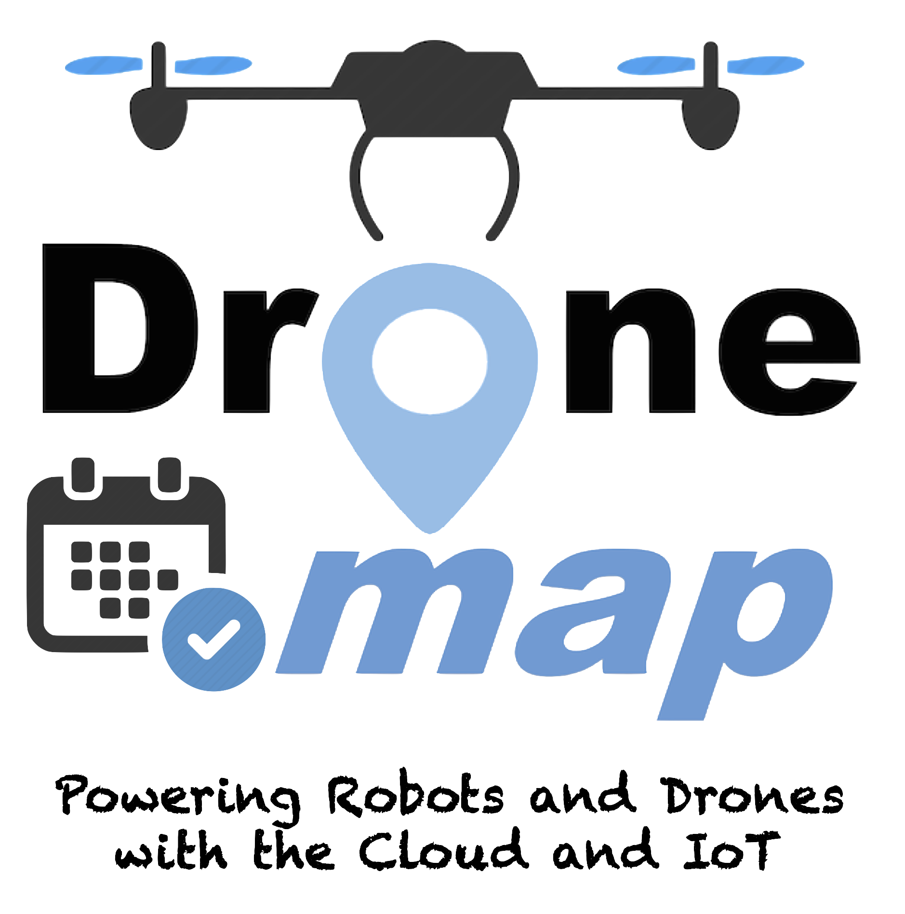

.. _dronemap_planner:

================
Dronemap Planner
================
 
   
.. toctree::
   :hidden:
   
   Overview  <dronemap-overview.rst>
   Setup and Configuration <dronemap-configuration.rst>
   Tutorials <dronemap-planner-tutorials.rst>

Gaitech ``Dronemap Planner`` is cloud-based robots and drones management system that allows to remotely control and monitor robots/drones over the Internet.

``Dronemap Planner`` represents an realization of a cloud-robotics system that integrates robots/drones into the Internet-of-Things (IoT) and clouds. 

``Dronemap Planner`` is an effective system to develop applications for drones/robots for the IoT and clouds.

We present a detailed overview of ``Dronemap Planner`` in the following tutorial pages.

For more technical details, please refer to our publication on `Dronemap Planner`_

.. _Dronemap Planner Paper: http://ieeexplore.ieee.org/document/7964096/