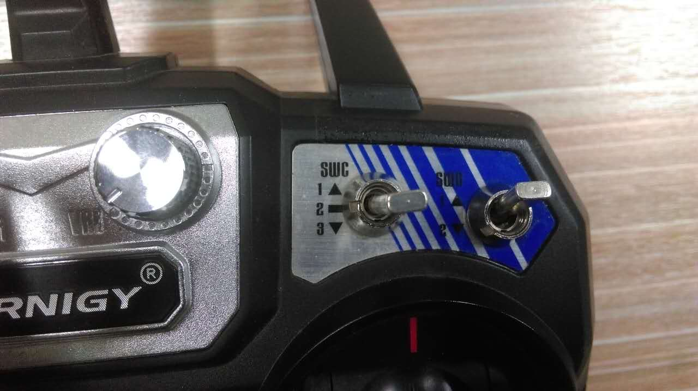

.. _first-flight-tests:

==========================
GAPTER: First Flight Tests
==========================

This section should describe the process to make some flight tests in indoor and outdoor environments with Gapter.  

* Test with remote control
* Test using MAVLink ground station
* Test using ROS

TESTING WITH RC.
================ 

Things to know
--------------

Before controlling Gapter in any mode you must know the flight modes and its respective positions in RC. We have configured 6 modes to control Gapter. Two modes are dedicated for manual mode and land mode. Rest of them is used for automatic positioning and guiding Gapter. Flight modes are as follows

.. code-block:: bash

	POSHOLD Mode     position 1
	Land Mode        position 2
	GUIDED Mode      position 3
	STABILIZE Mode   position 4
	LOITER Mode      position 5
	Alt_Hold Mode    position 6	

Positions in RC
---------------

The 6 positions of flight modes can be attained by the combination of two switches on top right corner of RC where we can name the last switch as “a” which has only two positions (up & down) before to last switch as “b” which  has three positions (up, middle and down). Now positions are as follows:

.. figure:: images/First_Flight_Tests_RC_fig_1.jpg
    :align: center
    :width: 200pt

    position1: a(down) & b(up) **POSHOLD Mode**

.. figure:: images/First_Flight_Tests_RC_fig_6.jpg
    :align: center
    :width: 200pt

    position2: a(up) & b(up) **Alt_Hold Mode**
    

    position3: a(down)& b(middle) **GUIDED Mode**

    position4: a(up) & b(middle) **STABILIZE Mode**

.. figure:: images/First_Flight_Tests_RC_fig_5.jpg
    :align: center
    :width: 200pt

    position5: a(down)& b(down) **LOITER Mode**

    position6: a(up) & b(down) **Land Mode**

Controllers
-----------

You can find two joystick controllers on RC, one is left “J1”and the other is on right “J2”. “J1” is to control throttle of motors & yaw moment of Gapter. Where as “J2” is used to control pitch(forward&backward) and roll(left and right) of Gapter

Testing Gapter 
--------------

To control Gapter follow these steps:

After turning ON Gapter you can find a safety switch in red color which starts blinking with beep sounds.

Press and hold safety switch until it stops blinking which turns to solid red and stops beep sound.

You can notice notification LED either in solid blue or green in color. Solid green states Gapter is positioned with gps. 

Turn on RC. Make sure throttle must be completely down and all the switches must be in up position. You have to notice Tx and Rx signal on RC screen. It even shows the battery level of Gapter at Rx and RC at Tx respectively. 

.. figure:: images/First_Flight_Tests_RC_fig_7.jpg
    :align: center
    :width: 200pt

    RC initial position

.. figure:: images/First_Flight_Tests_RC_fig_8.jpg
    :align: center
    :width: 200pt

    TX=RC's battery level  

    RX=Gapter's battery level

When you set RC switches , you might have noticed switches “a” & “b” are in up position which Gapter is in Land mode. Now change to loiter

Now to initialize Gapter, hold J1 stick down right corner. You can notice propellers must be running.

Slowly rise throttle upwards. While doing so Gapter will be flying now. Depending on rise of throttle, Gapter's altitude will be increasing.

Hold at one position and control J2 stick up, down, left and right for Gapter's forward, backward, left and right movements respectively

To control yaw movement of Gapter, move J1 stick left and right at its position.
Now to land Gapter Keep switches in position 6 (land mode). Gapter will land automatically to its current position.

.. NOTE::
    While working in stabilize mode be careful as throttle rises suddenly and Gapter will fly at a huge altitude.While operating throttle (J1 stick) be very careful as single point increment tends to change altitude at high rate.
