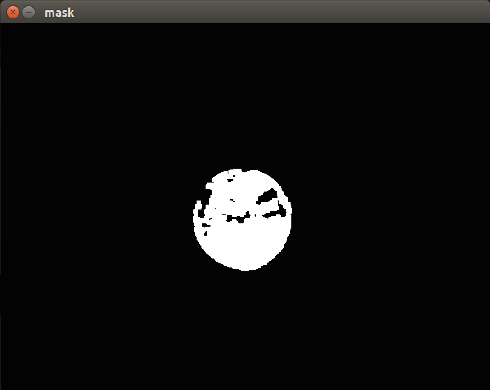
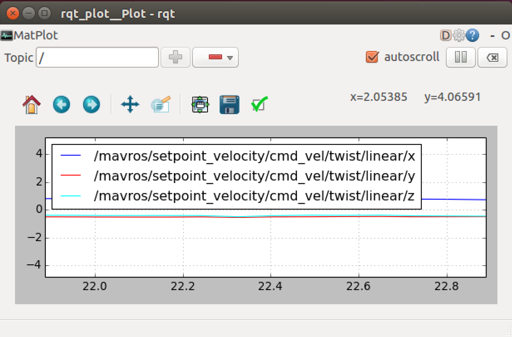

.. _gapter-target-tracking:

=======================
GAPTER: Ball Tracking
=======================

.. NOTE::

   In this tutorial you will learn how to:

      * run ball tracking code with gapter 
   
   For any query, please feel free to post your questions in the `Gaitech EDU Forum <http://forum.gaitech.hk/>`_

Prerequisite
============

* `Opencv 2.4 <https://gist.github.com/bigsnarfdude/7305c8d8335c7cfc91888485a33d9bd9>`_

* `imutils <https://github.com/jrosebr1/imutils>`_

Get ball tracking code
======================

Download the ball tracking code from `Github <https://github.com/aniskoubaa/gaitech_edu/tree/master/src/ball_tracking>`_

Run the code
=============

After running the Gapter Simulator, in a new terminal run following command:

.. code-block:: bash

 	$ python ball_tracking.py

You will see the following screen:

.. figure:: images/ball-tracking-frame.png
    :align: center
    :width: 400pt

It will run with default camera of computer, can be easily changed for other camera. If ball is green press 'c' on image window, or place the ball inside the rectanglar region and press 'a', press 'n' to re-calibrate and space-bar for pause, 'q' for quiting. If you have a green ball, you can hold it in as in the following screen:

.. figure:: images/ball-tracking-frame-with-ball.png
    :align: center
    :width: 400pt

After presing 'c', another window with a mask will appear:

Now in a new terminal run:

.. code-block:: bash

 	$ python pid_control.py

You can now move the ball, and see your Gapter following it. You can use rqt_plot to visualize current position using following command:

.. code-block:: bash

 	$  rqt_plot /mavros/setpoint_velocity/cmd_vel/twist/linear/x:y:z

|
|

.. youtube:: f8y7W9EQw8k
