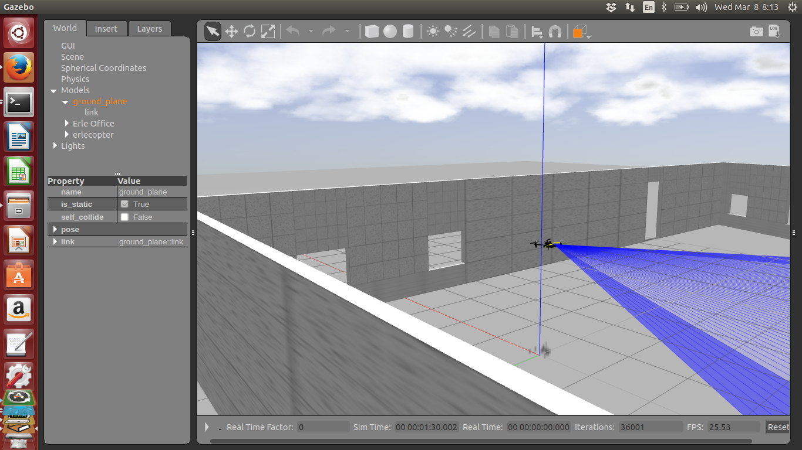
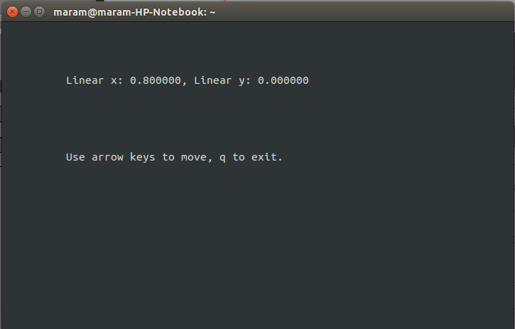
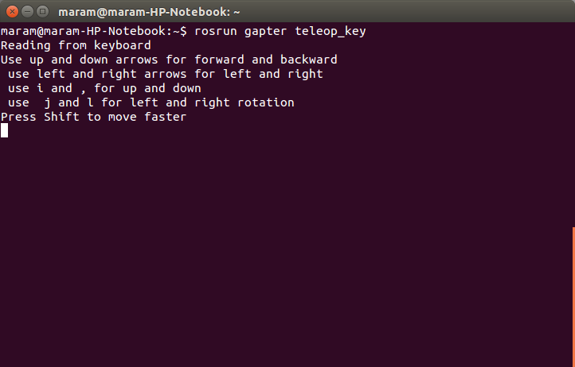

.. _gapter-ros-teleop:

=============================
GAPTER: Teleopration with ROS
=============================

This tutorial will introduce to you how to control your Gapter drone using ssh or across the wireless communication with your keyboard.

.. NOTE::

   In this tutorial you will learn how to:

      * Control your Gapter drone using ssh or across the wireless communication with your keyboard.
      
	This tutorial was developed for ROS `Indigo <http://wiki.ros.org/indigo>`_ version.

First launch the simulation, see following links for further details: 

TO BE PROVIDED

.. figure:: images/gapter_ros_teleop_fig_1.png
    :align: center
    :width: 400pt

    Figure 1: Launch the simulator

After launching the simulator, Take off the drone:

.. code-block:: bash

	# in the MAVProxy prompt:
	mode GUIDED
	arm throttle
	takeoff 2

    Figure 2: Drone taking off

Then, in new terminal, launch the ROS node (python) for teleoperation:

.. code-block:: bash

	rosrun gapter_py teleop_key.py 

.. figure:: images/gapter_ros_teleop_fig_3.png
    :align: center
    :width: 400pt

    Figure 3: Running Teleop node

    Figure 4: Running Teleop node

Or run the C++ node:

.. code-block:: bash

	rosrun gapter teleop_key

    Figure 5: Running Teleop node

Code Explanation
================

The source code of the keyboard teleop could be found in `github_link`_.

.. _github_link: https://github.com/

First initializes the ROS node for the process. Then creates an object from the class ``SimpleKeyTeleop`` to process the user input.

.. code-block:: python

 def main(stdscr):
    rospy.init_node('tele')
    app = SimpleKeyTeleop(TextWindow(stdscr))
    app.run()

In ``SimpleKeyTeleop``, a publisher is defined to publish ``TwistStamped`` message to ``/mavros/setpoint_velocity/cmd_vel`` topic:

.. code-block:: python

	self._pub_cmd = rospy.Publisher('/mavros/setpoint_velocity/cmd_vel', TwistStamped)

Following lines are to get the rate for the movement. 

.. code-block:: python

        self._forward_rate = rospy.get_param('~forward_rate', 0.8)
        self._backward_rate = rospy.get_param('~backward_rate', 0.5)
        self._rigth_rate = rospy.get_param('~rigth_rate', 0.5) 
        self._left_rate = rospy.get_param('~left_rate', 0.5)               

The second value passed to the ``rospy.get_param`` is a default value to use if the parameter is not set. So the forward rate will be 0.8 if the user choose to move the drone forward.

The first function will be executed from ``SimpleKeyTeleop`` is ``run``. 

.. code-block:: python

    def run(self):
        rate = rospy.Rate(self._hz)
        self._running = True
        while self._running:
            while True:
                keycode = self._interface.read_key()
                if keycode is None:
                    break
                self._key_pressed(keycode)
            self._set_velocity()
            self._publish()
            rate.sleep()

Whenever the user press any key, the ``self._key_pressed(keycode)`` function will be called, then ``self._set_velocity()`` to set the appropriate velocity, and lastly the ``self._publish()`` to publish the message. 

