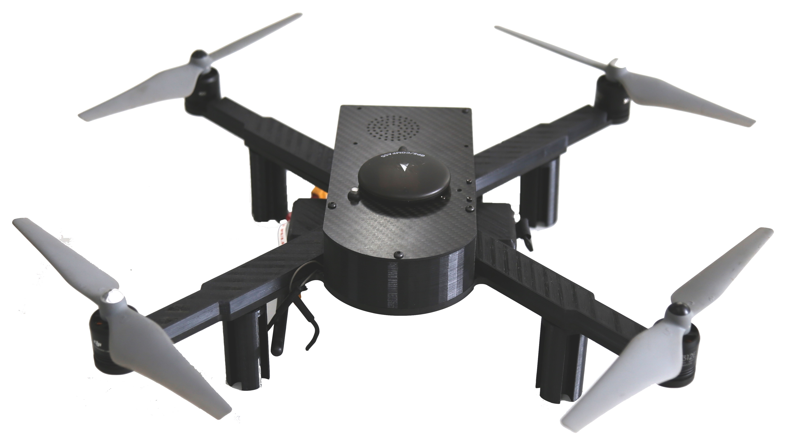

.. gapter documentation master file, created by
   sphinx-quickstart on Sun May  8 09:56:52 2016.
   You can adapt this file completely to your liking, but it should at least
   contain the root `toctree` directive.

.. _gapter-doc:

==========================
Gapter Drone Documentation
==========================
 
   
.. toctree::
   :hidden:
   
   Gapter Overview <overview-and-features.rst>
   Gapter Assembly <assembly.rst>
   Building and Configuring the Autopilot <building-and-configuring-autopilot.rst>
   Network Configuration <network-configuration.rst>
   Pre-Flight Configurations <preflight-configurations.rst>
   First Flight Test <first-flight-tests.rst>
   Software Tutorials <software-tutorials.rst>

Gaitech is proud to announce the release of its educational drone: Gapter, a shortcut for Gaitech Copter. 
This documentation presents step-by-step instructions and get started with Gapter and understand how to develop applications with it.

Enojoy our tutorials and technical support. 

For any questions, please interact with us through `Gaitech EDU Forum <http://forum.gaitech.hk/>`_.
To receive updates about Gapter and other Gaitech Products, subscribe to the  to the `Gaitech EDU Mailing List <http://lists.gaitech.coins-lab.org/listinfo.cgi/gaitech_edu_users-gaitech.coins-lab.org>`_..

 

TEST Maram
