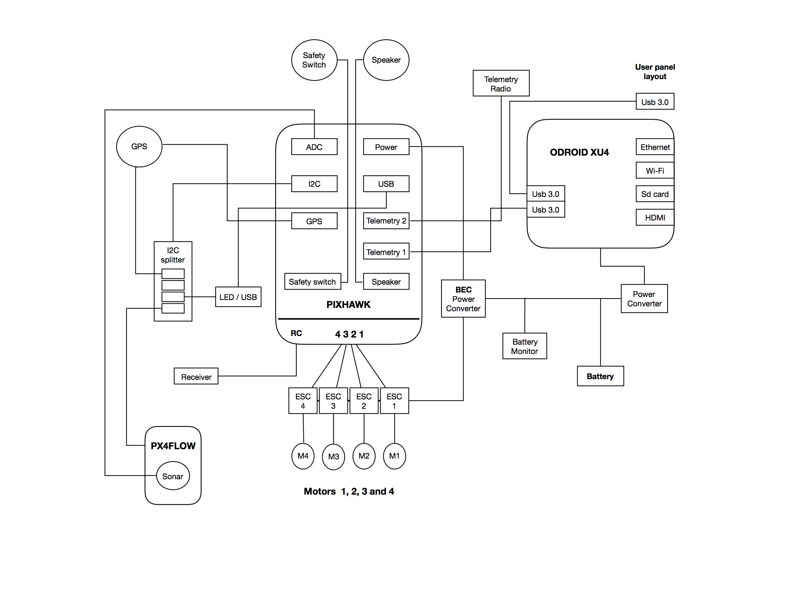

.. _gapter-internal-hardware-connections:

=====================================================
GAPTER: Gapter Brain and Internal Hardware Connection
=====================================================

This tutorial provides an overview about the internal hardware connection of Gapter and the different components of the Gapter brain. 

.. NOTE::

   In this tutorial you will learn how to:

      * the anatomy of the Gapter brain 
      * the components of the Gapter brain
      * the connections between the different components of the brain 
   
   For any query, please feel free to post your questions in the `Gaitech EDU Forum <http://forum.gaitech.hk/>`_

Gapter Brain Overview
=====================
The following image provides the schema of internal harwarde components and connections of the Gapter Brain. 

The Gapter Brain is composed of the Pixhawk autopilot hardware as drone controller, and the Odroid XU4 as single board computer provding additional onboard processing functionalities. 

The Pixhawk contains all the required navigation and flight control sensors and uses Ardupilot autpilot software to control the drone. 
Odroid XU4 single board computer extends the capabilities of Gapter by providing oboard computing and storage capabilities. It allows Gapter to be connected to the Internet. In addition, it host Robot Operating System (ROS) framework, which allows the user to develop onboard ROS program to control the drone and develop specific applications. 
Furthermore, DroneKit framework and MAVProxy are also installed on XU4 which provides another alternative to interact and develop programs for Gapter. 

The Gapter Brain provide unique functionalities to develop vast array of applications and programs for drones. 

Hardware Connections
====================

The following table present the internal hardward connections of the Gapter brain. 

+-+---------------+-----------------+-----------------+---------------------------------------------------------------------------+--------------------------------------------------------------------------------+--------------------------------------------------------------------------------+---------------------------------------------------------------------------------+
| | Connection    |                 | Connection      |                                                                           | No. of                                                                         |                                                                                |                                                                                 |
| | Number        |                 | between         | pins                                                                      |                                                                                |                                                                                |                                                                                 |
| |               | components      |                 | connecting                                                                | Description                                                                    |                                                                                |                                                                                 |
+=+===============+=================+=================+===========================================================================+================================================================================+================================================================================+=================================================================================+
| | 1             |                 | Sonar of        |                                                                           | Two pins                                                                       |                                                                                | Sonar connecting from px4flow to ADC of Pixhawk. Connecting slot contains       |
| | px4flow       |                 |                 |                                                                           |                                                                                |                                                                                |                                                                                 |
| |               | to ADC of       |                 | used in 3                                                                 |                                                                                | 4 pins but only two pins are used. So 2 wires connecting between them.         |                                                                                 |
| | pixhawk       | pin slot        |                 |                                                                           |                                                                                |                                                                                |                                                                                 |
+-+---------------+-----------------+-----------------+---------------------------------------------------------------------------+--------------------------------------------------------------------------------+--------------------------------------------------------------------------------+---------------------------------------------------------------------------------+
| | 2             |                 | I2C of px4flow  |                                                                           | Four pins                                                                      |                                                                                | I2C of px4flow sensor connecting to I2C of pixhawk via I2c splitter. Four pins  |
| |               | to I2C          |                 | used in 4                                                                 |                                                                                | are used. So 4 wires connecting between them.                                  |                                                                                 |
| | splitter      | pin slot        |                 |                                                                           |                                                                                |                                                                                |                                                                                 |
+-+---------------+-----------------+-----------------+---------------------------------------------------------------------------+--------------------------------------------------------------------------------+--------------------------------------------------------------------------------+---------------------------------------------------------------------------------+
| | 3             |                 | GPS to I2C      |                                                                           | Two pins                                                                       |                                                                                | GPS consists of two connecting wires. One connected to I2C of pixhawk via       |
| |               | splitter        |                 | used in 4                                                                 |                                                                                | I2C splitter. Two pins are used , so 2 wires connecting between them           |                                                                                 |
| |               | pin slot        |                 |                                                                           |                                                                                |                                                                                |                                                                                 |
+-+---------------+-----------------+-----------------+---------------------------------------------------------------------------+--------------------------------------------------------------------------------+--------------------------------------------------------------------------------+---------------------------------------------------------------------------------+
| | 4             |                 | GPS to GPS      |                                                                           | 4 pins are                                                                     |                                                                                | The other wire of GPS is connected to GPS slot of pixhawk. Four pins are used   |
| |               | slot of         |                 | used in                                                                   |                                                                                | in 6 pin slot. Hence 4 wires are connecting between them                       |                                                                                 |
| | pixhawk       | 6 pin slot      |                 |                                                                           |                                                                                |                                                                                |                                                                                 |
+-+---------------+-----------------+-----------------+---------------------------------------------------------------------------+--------------------------------------------------------------------------------+--------------------------------------------------------------------------------+---------------------------------------------------------------------------------+
| | 5             |                 | LED/USB to      |                                                                           | 4 pins are                                                                     |                                                                                | It LED/USB is the extension of pixhawk USB and LED notification. It consists of |
| |               | I2C             |                 | used in 4                                                                 |                                                                                | two connecting wires. One wire is connected to pixhawk I2C via I2C splitter.   |                                                                                 |
| | splitter      | pin slot        |                 | 4 pins are used and so 4 connecting wires are used.                       |                                                                                |                                                                                |                                                                                 |
+-+---------------+-----------------+-----------------+---------------------------------------------------------------------------+--------------------------------------------------------------------------------+--------------------------------------------------------------------------------+---------------------------------------------------------------------------------+
| | 6             |                 | Pixhawk’s       |                                                                           | 4 pins are                                                                     |                                                                                | It is an extension of I2C’s of pixhawk allowing more components to connect      |
| |               |                 |                 |                                                                           |                                                                                |                                                                                |                                                                                 |
| |               | I2C to I2C      |                 | used in 4                                                                 |                                                                                | pixhawk which are depending on I2C channel. We connect GPS and px4flow to      |                                                                                 |
| | splitter      | pin slot        |                 | this extension. 4 pins are used hence 4 wires are connecting between them |                                                                                |                                                                                |                                                                                 |
+-+---------------+-----------------+-----------------+---------------------------------------------------------------------------+--------------------------------------------------------------------------------+--------------------------------------------------------------------------------+---------------------------------------------------------------------------------+
| | 7             |                 | Pixhawk’s       |                                                                           | 4 pins are                                                                     |                                                                                | The other connecting wire of pixhawk’s USB extension is connected between       |
| | usb to        |                 |                 |                                                                           |                                                                                |                                                                                |                                                                                 |
| |               | usb             |                 | used in 4                                                                 |                                                                                | pixhawk serial USB port to USB extension. 4 pins are being used. Hence 4 wires |                                                                                 |
| | extension     | pin slot        |                 | are connecting between them                                               |                                                                                |                                                                                |                                                                                 |
+-+---------------+-----------------+-----------------+---------------------------------------------------------------------------+--------------------------------------------------------------------------------+--------------------------------------------------------------------------------+---------------------------------------------------------------------------------+
| | 8             |                 | Receiver to     |                                                                           | 2 pins are                                                                     |                                                                                | This is connecting between RC receivers to pixhawk’s RC connecting slot.        |
| | pixhawk’s     |                 |                 |                                                                           |                                                                                |                                                                                |                                                                                 |
| |               | receiving       |                 | used in 3                                                                 |                                                                                | 2 wires are used in 3 pin slot. Hence two wire are used.                       |                                                                                 |
| | channel       | pin slot        |                 |                                                                           |                                                                                |                                                                                |                                                                                 |
+-+---------------+-----------------+-----------------+---------------------------------------------------------------------------+--------------------------------------------------------------------------------+--------------------------------------------------------------------------------+---------------------------------------------------------------------------------+
| | 9             |                 | Safety switch   |                                                                           | 3 pins are                                                                     |                                                                                | This is connecting between safety switch to safety switch slot of pixhawk.      |
| | to safety     |                 |                 |                                                                           |                                                                                |                                                                                |                                                                                 |
| |               | switch slot     |                 | used in 3                                                                 |                                                                                | 3 pins are used in 3 pin slot. Hence 3 wires are connecting between them       |                                                                                 |
| | of pixhawk    | pin slot        |                 |                                                                           |                                                                                |                                                                                |                                                                                 |
+-+---------------+-----------------+-----------------+---------------------------------------------------------------------------+--------------------------------------------------------------------------------+--------------------------------------------------------------------------------+---------------------------------------------------------------------------------+
| | 10            |                 | Speaker         |                                                                           | 2 pins are                                                                     |                                                                                | This is connecting between speaker module to speak slot of pixhawk. 2 pins      |
| | connecting to |                 |                 |                                                                           |                                                                                |                                                                                |                                                                                 |
| |               | pixhawk         |                 | used in 2                                                                 |                                                                                | are used to connect in 2 pin slot. Hence 2 wires are used in connecting        |                                                                                 |
| | speaker slot  | pin slot        |                 | between them.                                                             |                                                                                |                                                                                |                                                                                 |
+-+---------------+-----------------+-----------------+---------------------------------------------------------------------------+--------------------------------------------------------------------------------+--------------------------------------------------------------------------------+---------------------------------------------------------------------------------+
| | 11            |                 | ESC to serial   |                                                                           | 2 pins are                                                                     |                                                                                | ESC 1,2,3,4 are connecting between serial channels of pixhawk 1,2,3,4           |
| |               |                 |                 | respectively. Each ESC connecting to each channel where 2 pins are used   |                                                                                |                                                                                |                                                                                 |
| |               | channel of      |                 | used in 3                                                                 |                                                                                | among 3 pins of each slot of channel. Hence each ESC occupying 2 wires.        |                                                                                 |
| | pixhawk       | pin slot        |                 | Totally 8 wires are connecting between all ESC to pixhawk. Among them 4   |                                                                                |                                                                                |                                                                                 |
| |               |                 |                 | wires are connected to negative terminal of channel slot.                 |                                                                                |                                                                                |                                                                                 |
+-+---------------+-----------------+-----------------+---------------------------------------------------------------------------+--------------------------------------------------------------------------------+--------------------------------------------------------------------------------+---------------------------------------------------------------------------------+
| | 12            |                 | ESC to motor    |                                                                           | 3 pins are                                                                     |                                                                                | Motors 1,2,3 and 4 connecting to ESC 1,2,3 and 4 respectively. Each motor       |
| |               |                 | used in 3       |                                                                           | uses 3 pins of esc and hence each motor connecting 3 wires between them.       |                                                                                |                                                                                 |
| |               | pin slot        |                 | Totally of 12 wires are being used to connect motors and ESC.             |                                                                                |                                                                                |                                                                                 |
+-+---------------+-----------------+-----------------+---------------------------------------------------------------------------+--------------------------------------------------------------------------------+--------------------------------------------------------------------------------+---------------------------------------------------------------------------------+
| | 13            |                 | ESC to powe     |                                                                           | 8 wires                                                                        |                                                                                | ESC is powered from power module of pixhawk where power from main               |
| |               | used            |                 |                                                                           |                                                                                |                                                                                |                                                                                 |
| |               | converter of    |                 |                                                                           | source is connected to ESC and pixhawk power module in parallel.               |                                                                                |                                                                                 |
| | pixhawk       |                 |                 | 4 positive and 4 negative wires are connecting.                           |                                                                                |                                                                                |                                                                                 |
+-+---------------+-----------------+-----------------+---------------------------------------------------------------------------+--------------------------------------------------------------------------------+--------------------------------------------------------------------------------+---------------------------------------------------------------------------------+
| | 14            |                 | Power slot of   |                                                                           | 6 wires                                                                        |                                                                                | Power is supplied to pixhawk from power converter of pixhawk which              |
| | pixhawk       | used in         |                 |                                                                           |                                                                                |                                                                                |                                                                                 |
| |               | to power        |                 | 6 pin slot                                                                |                                                                                | is sourced from battery. 6 wires are used to connect between them              |                                                                                 |
| | converter     |                 |                 |                                                                           |                                                                                |                                                                                |                                                                                 |
| |               | of pixhawk      |                 |                                                                           |                                                                                |                                                                                |                                                                                 |
+-+---------------+-----------------+-----------------+---------------------------------------------------------------------------+--------------------------------------------------------------------------------+--------------------------------------------------------------------------------+---------------------------------------------------------------------------------+
| | 15            |                 | Pixhawk to xu4  |                                                                           | 4 wires                                                                        |                                                                                | This is to make communication between pixhawk and xu4. A usb-ttl is used to     |
| |               | used in         |                 |                                                                           |                                                                                |                                                                                |                                                                                 |
| |               |                 | 6 pin slot      |                                                                           | connect pixhawk’s telemetry port 1 to usb ttl connecting to xu4’s usb. 4 wires |                                                                                |                                                                                 |
| |               |                 |                 | are being used in 6 pin slot.                                             |                                                                                |                                                                                |                                                                                 |
+-+---------------+-----------------+-----------------+---------------------------------------------------------------------------+--------------------------------------------------------------------------------+--------------------------------------------------------------------------------+---------------------------------------------------------------------------------+
| | 16            |                 | Telemetry 2     |                                                                           | 6 wires                                                                        |                                                                                | This is to connect between telemetry port 2 to telemetry radio. 6 wires are     |
| | to radio      | used in         |                 |                                                                           |                                                                                |                                                                                |                                                                                 |
| |               |                 | 6 pin slot      |                                                                           | used in 6 pin slot                                                             |                                                                                |                                                                                 |
+-+---------------+-----------------+-----------------+---------------------------------------------------------------------------+--------------------------------------------------------------------------------+--------------------------------------------------------------------------------+---------------------------------------------------------------------------------+
| | 17            |                 | Xu4 to power    |                                                                           | 2 wires                                                                        |                                                                                | This is to power xu4 form battery via power converter. A power converter        |
| |               | converter       |                 |                                                                           | which converts power to 5V, 4A is used to supply power to xu4. Two wires       |                                                                                |                                                                                 |
| |               |                 |                 | +ve and –ve are being used.                                               |                                                                                |                                                                                |                                                                                 |
+-+---------------+-----------------+-----------------+---------------------------------------------------------------------------+--------------------------------------------------------------------------------+--------------------------------------------------------------------------------+---------------------------------------------------------------------------------+
| | 18            |                 | Xu4 Usb 3.0     |                                                                           | Usb wire                                                                       |                                                                                | This is the usb 3.0 extension cable used to connect 3D sensor                   |
| | extension     |                 |                 |                                                                           |                                                                                |                                                                                |                                                                                 |
+-+---------------+-----------------+-----------------+---------------------------------------------------------------------------+--------------------------------------------------------------------------------+--------------------------------------------------------------------------------+---------------------------------------------------------------------------------+
| | 19            |                 | Power wire from |                                                                           | Two wires                                                                      |                                                                                | This is to supply power form battery to power converter of pixhawk. Two         |
| |               | battery to      |                 |                                                                           |                                                                                |                                                                                |                                                                                 |
| | pixhawk       |                 |                 |                                                                           | wires +ve and –ve are connected to this module                                 |                                                                                |                                                                                 |
| |               | power converter |                 |                                                                           |                                                                                |                                                                                |                                                                                 |
+-+---------------+-----------------+-----------------+---------------------------------------------------------------------------+--------------------------------------------------------------------------------+--------------------------------------------------------------------------------+---------------------------------------------------------------------------------+
| | 20            |                 | Power wire from |                                                                           | Two wires                                                                      |                                                                                | This is to supply power form battery to power converter of xu4. Two wires       |
| |               | battery to xu4  |                 |                                                                           |                                                                                |                                                                                |                                                                                 |
| |               | power converter |                 |                                                                           | +ve and – ve are connected to this module                                      |                                                                                |                                                                                 |
+-+---------------+-----------------+-----------------+---------------------------------------------------------------------------+--------------------------------------------------------------------------------+--------------------------------------------------------------------------------+---------------------------------------------------------------------------------+
| | 21            |                 | Battery to      |                                                                           | Two wires                                                                      |                                                                                | This is to connect battery moniter to battery. Two wires +ve and –ve are        |
| |               | battery monitor |                 |                                                                           | connected to this module                                                       |                                                                                |                                                                                 |
| |               |                 |                 |                                                                           |                                                                                |                                                                                |                                                                                 |
+-+---------------+-----------------+-----------------+---------------------------------------------------------------------------+--------------------------------------------------------------------------------+--------------------------------------------------------------------------------+---------------------------------------------------------------------------------+
| | 22            |                 | Battery to      |                                                                           | One wire                                                                       |                                                                                | This is to connect power switch from battery to switch and passing overall      |
| |               | power switch    |                 |                                                                           | power. A +ve wire is connected to switch from battery.                         |                                                                                |                                                                                 |
+-+---------------+-----------------+-----------------+---------------------------------------------------------------------------+--------------------------------------------------------------------------------+--------------------------------------------------------------------------------+---------------------------------------------------------------------------------+

