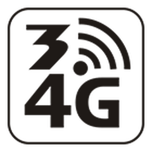
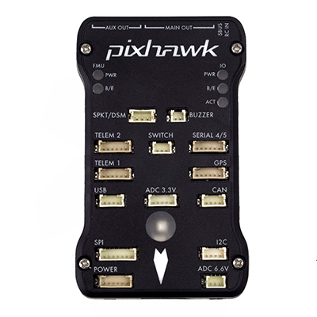
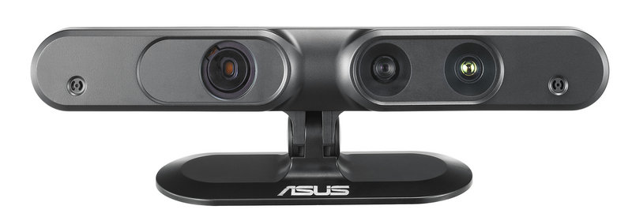

.. _gapter-overview-features:

================================================
GAPTER: Educational Copter using ROS and MAVLINK
================================================

Overview
========

Gapter is an unprecendanted drone with was carfeully designed to meet the requirements of researchers, students and teachers as an educational and research aerial platform. 
Gapter is a modular research and educational drone platform. It supports Robot Operating System (ROS), the MAVLink protocol, and the mavros wrapper layer between ROS and MAVLink.

It is based on the Pixhawk platform independent autopilot software using the Ardupilot software, and reenforced with an embedded computer Odroid XU4, which is proven to be more powerful than other single board computers, like Raspberry PI, typically used in other drones. 

Unlike other UAVs Gapter can work both indoor and outdoor with its inbuilt sensors like GPS and optical flow sensors. 
It has different types of connectors like power, USB and I2C allowing the user to extend their platform by connecting their own modules or sensors.

Users can connect to Gapter easily to its WiFi and also connected to Internet using 3G/4G router.

 
What makes GAPTER different from other drones?
==============================================

Gapter has several features, when combined together, makes it a unique and different platform. 

    
**ROS-Enabled Drone**: Gapter EDU is a perfect platform to learn drone programming with ROS. A comprehensive ROS package with several demos is available for Gapter

**Supports the MAVLink Protocol**: Gapter fully support the MAVLink protocol allowing its control and monitoring through MAVLink ground stations. You can easly define and control autonmous missions of Gapter drone through Internet or Telemtry devices.

    
**Internet Connectivity**: Using a 3G/4G WiFi model you can make Gapter accessible through Internet or Local Area Network. Using Dronemap Planner software along with the 3G/4G WiFi router, you can control and monitor Gapter anywhere in the world through the Internet.

    
**Pixhawk**: Pixhawk is open-source flight controller platform providing a high-quality autopilot widely accepted in robotics community. Pixhawk contains a vast array of integrated sensors including 3D accelerometer, gyroscorp, magnetometer, barometer and much more. It is nativaley support the Ardupilo flight controller software and the MAVLink protocol

.. image:: images/features/xu4.jpg
    :align: left
    :width: 100pt
    

**Ordoid XU4 SBC**: Odroid XU4 single-board computer is integrated with Pixhawk to provide the best performance possible for the autopilot. XU4 is a powerful single board computer which is know to be four times faster than Raspberry PI2 and also equipped with 1GB Ethernet network interface and 2G of RAM. Gapter leverages the integrated use of XU4 and Pixhawk to provide an ultimate experience and a flexible and modular platform for users and developers.

    
**3D Sensor**: This is a unique feature in Gapter as compared to other COTS drone platforms, as 3D sensor allows both to have onboard camera in addition to a laser range finder used to avoid obstable and navigate more safely. In addition, Asus Live Pro 3D sensor is fully compatible with ROS. 

.. image:: images/features/software.png
    :align: left
    :width: 100pt
    
**Software and Educational Tools**: Gapter EDU was designed with research and education in mind. Gapter comes with a comprehensive documentation and software packages that allows a user to easily start working and developing with Gapter. Software packages including both ROS and MAVLink in addtion to MAVROS. Gaitech EDU portal provides an technical resources to start developing applications with Gapter, user manual and guides. Furthemore, Gaitech Forum provides customers with continuous technical support and responses to their queries.

Mechanical Features
===================
We need to have symbolic picture, and a table providing the description of the drone including

adding some new text

* dimensions
* weight
* payload
* Drone type: quadcopter (X or + config)
* Propellers Type
* Color
* 3D sensor
* Battery type

...

