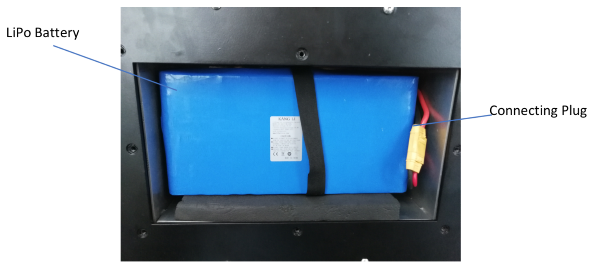
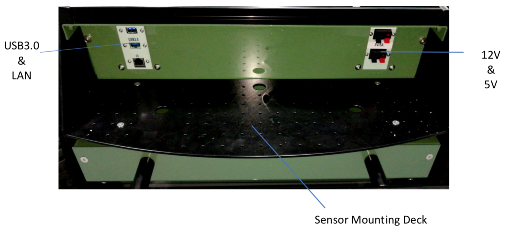

.. _ria-r100-battery:

===================
Battery and charger
===================

Battery details
---------------

RIA-R100’s battery is custom made according to requirements of robot power consumption. It is a Li-Po 7 battery pack with balanced charging capability. Its operating voltage of 24V with a capacity of 69.7Ah. Maximum current output from battery is 160A. It is placed at underside of robot at middle. Battery is connected to robot with 100A fuse limiting for safety. To keep hassle free in maintaining multiple batteries for extended usage huge capacity battery has been chosen and its standard run time over plane surface is up to 10 hours and laboratory usage is up to 18 hours based on usage.
	
It can be charged by connecting charger at back port of rear control panel. No need to remove battery. It is completely embedded within robot and properly fused.

    Fig 1. Battery of RIA-R100. Underside view of robot.

It is wrapped with belt which is comfortable to remove and replace battery from robot. It is connected with XT60 pin which is easy to plug out and plug in. 

Charger Details
---------------

The battery charger provided with RIA-R100 is tuned according to battery ratings used in robot. Following are charger parameters:

    Fig 2. Mean Well  Charger 29.5V, 10.5A

Discharge Rate: 29.5V, 10.5A 

Note: Make sure to select proper input voltage accordingly (220V/120V)

