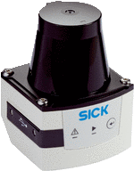

.. _ria-r100-external-components:

===============================
External Components and Details
===============================

RIA FRONT AND BACK VIEW PICTURES

Chassis
--------

Robot body is completely made of high grade Aluminum alloy which is strong enough to withhold huge payloads and protects internal components. It is designed in such a way that total load will be applying over wheels and doesn’t affect any components. 

Its wide structure maintains low center of gravity and ensures safety in maintaining ground level even at hazard surfaces. All components including battery are placed in such a way that total weight acts at its center

Motors and Wheels
------------------

RIA-R100 is driven by two brushed DC motors and four wheels. Each motor drives two wheels with belt transform motion. Both motors are configured equally with an output power of 274W. They are fixed inside chassis on lower frame and connected to wheels externally. Two Optical encoders are fixed at rear shaft of each motor and wheels are attached to front shaft.
	

RIA-R100 wheels are wide with high traction which are capable in moving over rough terrain. Their tires are tubeless and easily maintainable. Four wheels attached to motor shaft using coupler with three nuts each which can be easily detachable. No cable from motors are exposed which is hassle free to maintain.

User Mounting Plates
--------------------

Top portion of RIA-R100 is covered with thick plate which is capable to hold heavy payloads. User can utilize its 500x514mm space to develop according to their requirement. This plate is strong enough holding manipulators and other hardware controllers. It has wide hole at middle which allows cables to pass through it and thus connecting to internal pc and power directly. It is easy to remove this plate and fix other hardware control boards or to access inside components.

At front, another plate is placed which is over sensor deck. It is used to mount sensors like camera, laser scanners, RGBD and so. It can be communicated with internal PC via free USB and power connecters which are at sensor deck portion. Sensor deck plate is equipped with several holes allowing user to connect their sensors using screws. All cables and wires can be placed under side of this plate in order to avoid damage.

Control Panel
-------------

.. figure:: images/ria_r100_components_fig03.png
    :align: center

    Fig 3. Rear control panel

The rear cover of RIA-R100 holds main user control panel and front portion covers limited control panel dedicated for sensor deck.

It embedded with following elements:

**Main Control Panel**

1. **E-stop:** Enabling Emergency Stop button indicated LED over for user notification and stops motors to rotate. While enabled program which is being executed will not be interrupted. So when released the program continues and controller starts accepting commands.

2. **Charging port:** It is a two pin port which allows to charge battery without removing battery from robot. It fits with the charger which is provided with RIA-R100. It is warned  to turnoff robot while charging.

3. **Wi-Fi Antennas:** Two tall antennas are being fixed at control panel which allows to communicate well with robot’s router without any interruption. They are flexible in rotating and keeping at desired position to that interfacing with components which are placed on top of robot can be avoided.

4. **Battery Display:** Digital battery display shows indication of battery status in percentage. while charging battery and battery completely charged it may show indication with an error of 5%. So, consider its percentage only for indication but not as true values of battery. It helps user to check if battery is about to drain and to charge when needed.

5. **Main Power Switch:** It is the overall power switch which is square shaped red in color with LED indication. It maintains complete flow of power to the robot. Since it is main power control switch it is always recommended to turnoff rest of components like PC before turning off main power switch. sudden powering off PC may damage OS.

6. **PC switch:** It is power switch which is round shaped blue color with LED indication. Single press of this switch turns ON internal PC. The same works to turnoff PC too. It is always recommended to turnoff PC by single pressing this switch and then turning off main power switch. sudden powering off PC may damage OS.

7. **HDMI port:** HDMI port gives direct access to connect display of internal PC. RIA-R100 is configured with desktop utilities. When connected you can have a view of desktop and allows to access all files just like PC.

8. **Free 2x USB3.0 ports:** Two USB3.0 ports are embedded over control panel and allows to access PC’s internal ports directly. One of USB port is dedicated to joystick controller. An USB splitter can be used to connect multiple devices like keyboard, mouse and others

9. **LAN port:** A WLAN port has been embedded which have a direct access to one of WLAN ports of internal PC (RIA-R100 contains two WLAN ports). It allows to connect devices which need to be communicated using LAN based connections. it also allows to connect Ethernet cable and thus allows to access internet to update software packages or download for further development 

10. **Power Port:** A 24V which is fused at 5A has been fixed at right side which allows to connect devices. It can be altered with fuses up to 30A. For this internal fuse has to be changed at fuse box. 

**Control Panel at Sensor Deck**

    Fig 4. Front panel and sensor deck portion

1. **Free 2x USB3.0 ports:** Two USB3.0 ports are embedded at front portion of control panel over sensor deck. It allows to access PC’s internal USB ports directly. sensors which are mounted over sensor deck plate can be communicated with PC via these USBs and quite easy to plug. No hassle to worry about length of cables. 

2. **LAN Port:** A LAN port has been embedded at sensor deck next to USB ports. It is connected to one of ports of Wi-Fi router which allows to connect sensors that has to be communicated with PC via LAN ports. 

3. **Power Ports:** Two power ports which are rated with 12V and 5V fused at 5A each are placed on other side or sensor deck control panel. It allows to power up sensors which are mounted over sensor deck. 

RGBD Camera (Optional)
----------------------

.. figure:: images/ria_r100_components_fig05.png
    :align: center

    Fig 5. RGBD Camera – Astra Orbbec

RGBD camera is placed at front over sensor deck. It is connected to one of free USB3.0 at front panel. It is powered from same USB port

**Specifications:**

=================  ======================================== 
Size/Dimensions	   160 x 30 x 40 mm
Weight             0.3 kg
Range              0.6 – 8m (Optimal 0.6 – 5m)
Depth Image Size   640*480 (VGA) @ 30FPS
RGB Image Size     1280*720 @ 30FPS (UVC Support)
Field of View      60° horiz x 49.5° vert. (73° diagonal)
Data Interface     USB 2.0
Microphones        2
Operating Systems  Windows, Linux, Android
Power              USB 2.0
=================  ========================================

SICK Laser Sensor (Optional)
----------------------------

    Fig 6. Sick Tim571 Two Dimensional Laser Sensor

**FEATURES**

=================================  ======================================== 
Application                        Outdoor / Indoor
Light source                       Infrared (850 nm)
Aperture angle                     270° (Limited to 180° wide at sensor deck)
Scanning frequency                 15 Hz
Angular resolution                 0.33°
Operating range                    0.05 m ... 25 m
Max. range with 10 % reflectivity  8 m
=================================  ========================================

**INTERFACES**

==================  ========================================
Interfaces          Ethernet/Micro USB
Optical indicators  2 LEDs (ON, "device ready")
==================  ========================================

**MECHANICS/ELECTRONICS**

======================  ========================================================================= 
Electrical connection   1 x “Ethernet” connection, 4-pin M12 female connector
|                       1 x connection “Power/Synchronization output” 5-pin, M12 male connector
|                       1 x Micro USB female connector, type B
Operating voltage       9 V DC ... 28 V DC
Power consumption       Typ. 4 W
Dimensions (L x W x H)  60 mm x 60 mm x 86 mm
======================  ========================================================================= 

