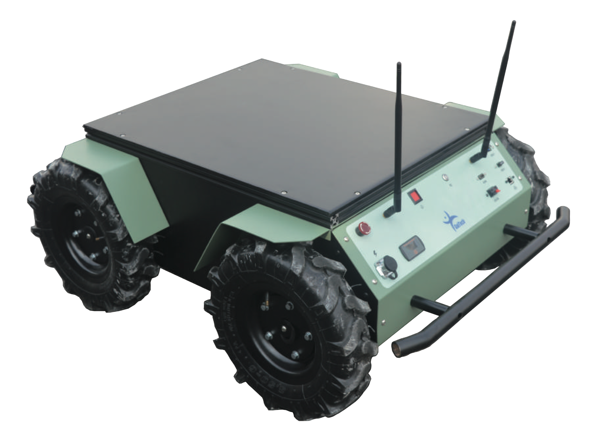

.. gapter documentation master file, created by
   sphinx-quickstart on Sun May  8 09:56:52 2016.
   You can adapt this file completely to your liking, but it should at least
   contain the root `toctree` directive.

.. _ria-doc:

==========================
RIA-R100 Documentation
==========================
 
   
.. toctree::
   :hidden:
   
   RIA-R100 Overview <overview.rst>
   RIA configuration packages <configuration.rst>
   External Components and Details <external-components.rst>
   Internal Components and Details <internal-components.rst>
   System Architecture <system-architecture.rst>
   Software Architecture <software-architecture.rst>
   Manual Control <manual-control.rst>
   Battery and charger <battery.rst>
   Mechanical Drawings <mechanical-drawings.rst>
   Maintenance <maintenance.rst>
   Warning and safety precautions <r100-warning.rst>
   Quick Start <quick-start.rst>
   Installation <installation.rst>
   Demo Applications <demo-apps.rst>
   Simulation <simulation.rst>

RIA-R100 is a medium sized Unmanned Ground Vehicle which leads your research anywhere you go with its high torque, high traction wheels and high load capabilities. It’s well configured internal PC keeps your work flexible and get ready to go.

This document explains and give clear idea of RIA-R100’s hardware and software architecture. It describes how to control, maintain robot and provide safety precautions. At the end robot’s mechanical drawings can be found which helps user to estimate how to extend it to develop based on their requirement.

Enojoy our tutorials and technical support. 

For any questions, please interact with us through `Gaitech EDU Forum <http://forum.gaitech.hk/>`_.
To receive updates about RIA-R100 and other Gaitech Products, subscribe to the  to the `Gaitech EDU Mailing List <http://lists.gaitech.coins-lab.org/listinfo.cgi/gaitech_edu_users-gaitech.coins-lab.org>`_..

 

