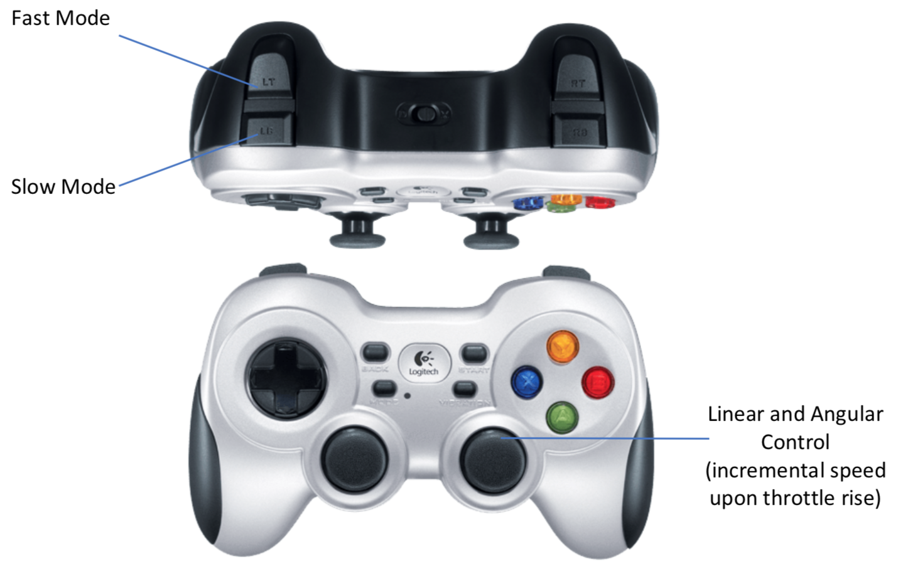

.. _ria-r100-manual-control:

==============
Manual Control
==============

RIA-R100 is configured with out of box control. No need to launch any files from host PC. Turning ON robot will launch minimal file which includes base controller, IMU and teleop using JOY stick. 
	

It is integrated with JOY stick controller which is from Logitech.

    Fig 1. Game Pad – Logitech f710

To control RIA hold one of required modes and control it using right joystick

2.4 GHZ wireless communication

Bluetooth connectivity

USB receiver is connected to one of free USB3.0 ports of RIA-R100
