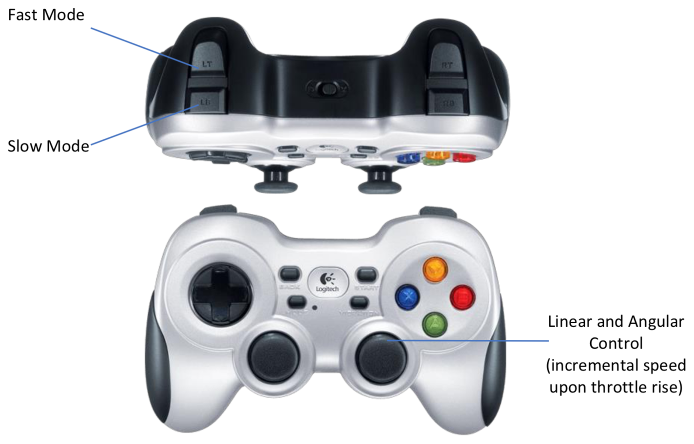

.. _ria-r100-quick-start:

===========
Quick Start
===========

* This step requires a complete understanding from manual.
* By the end of this step you will be able to control RIA-R100 with Joystick which has been provided with the box.
* When RIA-R100 shipped battery might by not fully charged. It is recommended to charge the robot before start using it.
* Make sure RC has been loaded with batteries.
* Turn on Main power switch and then turn on CPU power switch.
* Let robot load all required libraries for a minute.
* Now try to twist robot instead of controlling it linearly to get used with its sensitivity.

Controls
--------
* Linear Slow Motion: Holding slow mode switch + throttle rise
* Angular Slow Motion: Holding slow mode switch + throttle side
* Linear Fast Motion: Holding fast mode button + throttle rise
* Angular Fast Motion: Holding fast mode button + throttle side

    Fig 1. Game Pad – Logitech f710
