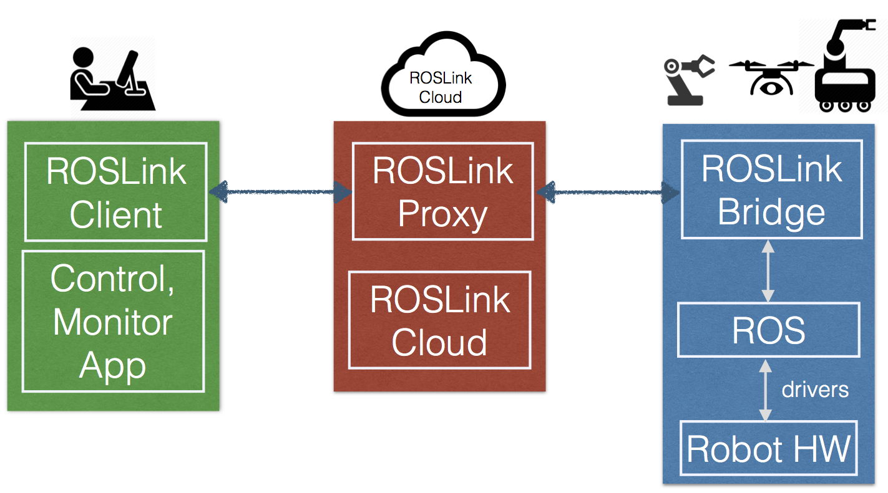
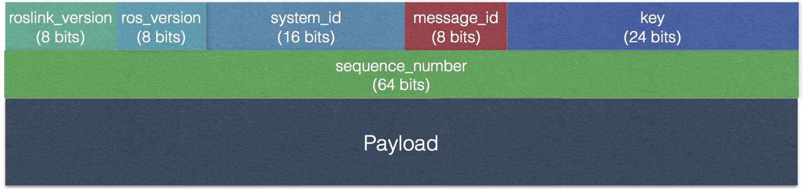

.. _roslink:

========
ROSLink
========
ROSLink is a new protocol to integrate Robot Operating System (ROS) enabled-robots with the IoT. The motivation behind ROSLink is the lack of ROS functionality in monitoring and controlling robots through the Internet. The architecture of ROSLink is depicted in Figure 1.

    Figure 1: ROSLink Architecture

The ROSLink is composed of three main parts:

	* The ``ROSLink Bridge``: this is the main component of the system. It is the interface between ROS and the ROSLink protocol. This bridge has two main functionalities: (1) it reads data from messages of ROS topics and services, serializes the data in JSON format according to ROSLink protocol specification, and sends to a ground station, a proxy server or a client application, (2) receives JSON serialized data through a network interface from a ground station or a client application, deserializes it from the JSON string, parse the command, and executes it through ROS.
	* The ``ROSLink Proxy`` and Cloud: it acts as a proxy server between the ROSLink Bridge (embedded in the robot) and the user client application. Its role is to link a user client application to a ROS-enabled robot through its ROSLink Bridge. The ROSLink proxy is mainly a forwarder of ROSLink messages between the robot and user. It allows to keep the user updated with the robot status, and also forward control commands from the user to the robot. In addition ``ROSProxy`` interact with ROSLink Cloud component, to maintain and manages the list of robots and users, create a mapping between them, and perform all management functionality, including security, quality-of-service monitoring, etc. 
	* The ``ROSLink Client Application``: it basically represents a control and monitoring application of the robot. This application is intended to monitor the status of the robot that it receives through ROSLink messages via the ROSLink Proxy from the robot. In addition, it sends commands through ROSLink messages to control the robot activities.  

The ``ROSLink Bridge`` consists of fully-functional ROS script written in Python, which is executed as ROS node in the client. Different ``ROSLink Bridge`` most be created for each robot which can be either real or simulated. 

How to Create ROSLink Bridge Client
-----------------------------------

Following steps show how to create a ``ROSLink Bridge`` client:

**Step 1: Identify required topics:** First step before writing ``ROSLink Bridge`` is to know all the needed topics to be used to get information from or to publish on them. Also, the data structure for the message to be passed on the topic must be known. Thus, for each topic we have to specify following: ``topic name``, ``Message type``, ``publish`` or ``subscribe``. 

**Step 2: Declare a set of ROS publishers and subscribers:** ``ROSLink Bridge`` is a fully-functional ROS node, so it can access all ROS topics and services. The publishers and subscribers cab be declared for all the required topics in the same way as in any typical ROS node. 

**Step 3: Declare a set of ROS parameters:** Some information about the robot or the system can be provided as parameters such as: ``robot name``, ``ROSLink proxy IP``, ``ROSLink proxy port``, ``heartbeat message period``, ``system ID``, etc. These parameters can be assigned with some default values and also can be configured as needed from ROS launch file.

**Step 4: Declare ROSLink messages:** Create data structure or class to represent ``ROSLink`` messages. Different ``ROSLink`` messages can have different structure, an array or a list or any other data structure can be used to represent them. The ROSLink communication protocol is based on the exchange of ROSLink messages. ROSLink messages are JSON formatted strings that contain information about the command and its parameters. To standardize the type of messages exchanged, we specified a set of ROSLink messages that are supported by the ROSLink Proxy. These messages can be easily extended based on the requirements of the user and the application. There are two main categories of ROSLink messages: (i.) State messages: these are message sent by the robot and carry out information about the internal state of the robot, including its position, orientation, battery level, etc. (ii.) Command messages: these are messages sent by the client application to the robot and carry out commands to make the robot execute some actions, like for example moving, executing a mission, going to a goal location, etc. 

A ROSLink message is a composed of a header and a payload. The structure of the ROSLink message header is presented in Figure 2.

    Figure 2: ROSLink Message Header Structure

The total header size is 128 bits:

The ``roslink version`` is encoded as a short int on 8 bits and specifies the version of ROSLink protocol.

The ``ros version`` specifies the ROS version (e.g. Indigo). 

The ``system id`` is an int encoded into 16 bits and specifies the ID of the robot. It helps in differentiating robots from each other at the server side. It is possible to encode the system id in 8 bits to reduce the header size, but the problem this restricts the scalability of the system to only 256 robots ID. 

The ``message id`` specifies the type of message received. It helps in correctly parsing the incoming message and extract underlying information. 

The ``sequence number`` denotes the sequence of the packet, identifies a single packet, and avoid processing duplicate packets. 

The ``key`` field is encoded on 24 bits and is used to identify a robot, and to map it to a user. A user that would like to have access to a robot, must use the same key that the robot is using in its Heartbeat message.

.. code-block:: Python

 __package__ = 'messages'

 import sys
 import json

 class ROSLinkHeader(object):

	def __init__(self, roslink_version=None, ros_version=None, system_id=None, message_id=None, sequence_number=None, key=None):
		self.roslink_version = roslink_version
		self.ros_version = ros_version
		self.system_id = system_id
		self.message_id = message_id
		self.sequence_number = sequence_number
		self.key = key
		pass
		
	def from_json(self, message):
		self.__dict__ = json.loads(message)
		self.roslink_version = self.__dict__['header']['roslink_version']
		self.ros_version = self.__dict__['header']['ros_version']
		self.system_id = self.__dict__['header']['system_id']
		self.message_id = self.__dict__['header']['message_id']
		self.sequence_number = self.__dict__['header']['sequence_number']
		self.key = self.__dict__['header']['key']
		
	def printMessage(self):
		print '--------------------------'
		print 'roslink_version: ', self.roslink_version
		print 'ros_version    : ', self.ros_version
		print 'system_id      : ', self.system_id
		print 'message_id     : ', self.message_id
		print 'sequence_number: ', self.sequence_number
		print 'key            : ', self.key
		print '--------------------------'
		

The payload carries out data relevant for each ROSLink message type. ROSLink defines several state message and command types. Following is the most common state and command messages:

**Presence message:** the robot should declare its presence regularly to declare itself and to be considered as active. Typically, Heartbeat messages sent at a certain frequency (typically one message per second) are used for this purpose. Following is the heartbeat message class:

.. code-block:: Python

 __package__ = 'messages'

 import json

 class HeartBeat(object):
    def __init__ (self, header=None, robot_type=None, name=None, system_status=None, owner_id=None, mode=None):
        self.header = header
        self.type = robot_type
        self.name = name
        self.system_status = system_status
        self.owner_id = owner_id
        self.mode = mode
        
    def from_json(self, message):
        self.__dict__ = json.loads(message)

        
    def printMessage(self):
        print 'type: ', self.type
        print 'name: ' , self.name
        print 'system_status: ' , self.system_status
        print 'owner_id: ' , self.owner_id
        print 'mode: ' , self.mode

**Motion messages:** In robot mission, it is important to know the location and odometry motion parameters (i.e.linear and angular velocities) of the robot at a certain time. Thus, a motion message containing position information of the robot should be periodically broadcast.

.. code-block:: Python

 __package__ = 'messages'

 import json

 class GlobalMotion(object):
    def __init__(self, header=None, time_boot_ms=None, x=None, y=None, z=None, vx=None, vy=None, vz=None,  wx=None, wy=None, wz=None, pitch=None, roll=None, heading=None):
        self.header = header 
        self.time_boot_ms = time_boot_ms
        self.x = x
        self.y = y
        self.z = z
        self.vx = vx
        self.vy = vy
        self.vz = vz
        self.wx = wx
        self.wy = wy
        self.wz = wz
        self.pitch = pitch
        self.roll = roll
        self.heading = heading

    def from_json(self, message):
        self.__dict__ = json.loads(message)
        
    def printMessage(self):
        print 'time_boot_ms: ', self.time_boot_ms
        print 'x: ', self.x
        print 'y: ', self.y
        print 'z: ', self.z
        print 'vx: ', self.vx
        print 'vy: ', self.vy
        print 'vz: ', self.vz
        print 'wx: ', self.wx
        print 'wy: ', self.wy
        print 'wz: ', self.wz
        print 'pitch: ', self.pitch
        print 'roll: ', self.roll
        print 'heading: ', self.heading

**Sensor messages:** The robot needs to broadcast its internal sensor data such as IMU, laser scanners, camera images, GPS coordinates, actuators states, etc. ROSLink also defines several sensor messages to exchange these data between the robot and the user.

.. code-block:: Python

 __package__ = 'messages'

 import json

 class GPSRawInfo(object):
    def __init__(self, header=None, time_usec=None, fix_type=None, lat=None, lon=None, alt=None, eph=None, epv=None, vel=None, cog=None, satellites_visible = None ):
        self.header = header 
        self.time_usec = time_usec
        self.fix_type = fix_type
        self.lat = lat
        self.lon = lon
        self.alt = alt
        self.eph = eph
        self.epv = epv
        self.vel = vel
        self.cog = cog
        self.satellites_visible = satellites_visible

    def from_json(self, message):
        self.__dict__ = json.loads(message)
        
    def printMessage(self):
        print 'time_usec: ', self.time_usec
        print 'fix_type: ', self.fix_type
        print 'lat: ', self.lat
        print 'lon: ', self.lon
        print 'alt: ', self.alt
        print 'eph: ', self.eph
        print 'epv: ', self.epv
        print 'vel: ', self.vel
        print 'cog: ', self.cog
        print 'satellites_visible: ', self.satellites_visible

    

.. code-block:: Python

 __package__ = 'messages'

 import json

 class RangeFinderData(object):
    def __init__(self, header=None, time_usec=None, angle_min=None, angle_max=None, angle_increment=None, time_increment=None, scan_time=None, range_min=None, range_max=None, ranges=None, intensities=None):
        self.header = header
        self.time_usec = time_usec
        self.angle_min = angle_min
        self.angle_max = angle_max
        self.angle_increment = angle_increment
        self.time_increment = time_increment
        self.scan_time = scan_time
        self.range_min = range_min
        self.range_max = range_max
        self.ranges = ranges
        self.intensities = intensities

    def from_json(self, message):
        self.__dict__ = json.loads(message)
        
    def printMessage(self):
        print 'time_usec: ' , self.time_usec
        print 'angle_min: ' , self.angle_min
        print 'angle_max: ' , self.angle_max
        print 'angle_increment: ' , self.angle_increment 
        print 'time_increment: ' , self.time_increment 
        print 'scan_time: ' , self.scan_time 
        print 'range_min: ' , self.range_min 
        print 'range_max: ' , self.range_max 
        print 'ranges: ' , self.ranges 
        print 'intensities: ' , self.intensities 

**Motion commands:** For the robot to navigate in ROS, certain commands are sent to it like ``Twist`` messages in ROS, goal/waypoint locations, and takeoff/landing command for drones. 

The takeoff command message class:

.. code-block:: Python

 __package__ = 'messages'

 import json

 class Takeoff (object):
    def __init__ (self, header, altitude):
        self.header = header
        self. altitude = altitude

The landing command message class:

.. code-block:: Python

 __package__ = 'messages'

 import json

 class Land (object):
    def __init__ (self, header):
        self.header = header

The aforementioned list is not exhaustive as other types of messages can be designed based on the requirements of the users and available information from the robot. 

**Step 5: Send ROSLink message:** After subscribing to topics and getting their information, the ``ROSLink`` messages will be updated with these information and sent to the ``ROSLink proxy``.

**Step 6: Receive ROSLink message:** The ``ROSLink Bridge`` will receive command messages from ``ROSLink proxy``. After parsing the incoming ``ROSLink Message`` and extracting the command, the ``ROSLink Bridge`` publishes the command to the appropriate ROS topic or request the appropriate ROS service to execute the action. The ``ROSLink Bridge`` will know what topic to publish with message content from ``message_id`` field from  ``ROSLink`` message.

