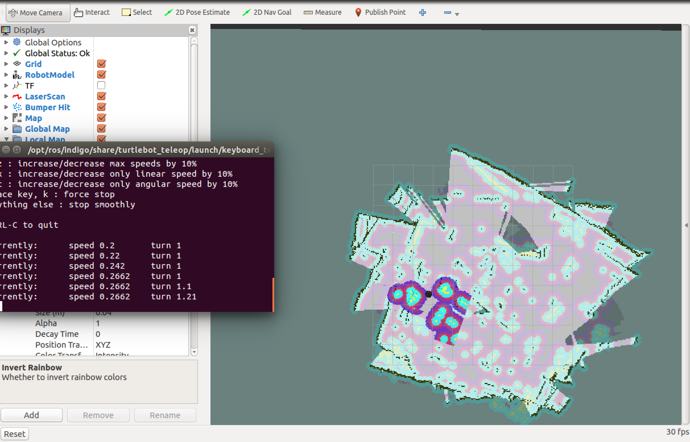

.. _create-map-kenict:

==================================
Building a Map using Kenict sensor
==================================

In this tutorial you will learn how to build your own map using Kenict sensor attached to your turtlebot. 

.. WARNING::
    Make sure that you completed installing all the required packages in the previous tutorials, your network set-up is working fine between the ROS Master node and the host node.

By default, ROS indigo supports ``Asus Live Pro`` 3D sensor and has no default support to ``Kinect`` 3D sensor. 
If you use ``Asus Live Pro`` 3D sensor, then skip the Kinect configuration step below. 

Kinect 3D sensor configuration
==============================
In order to connect the ``Kinect`` sensor with the ROS Indigo environment, you can type the following three commands in your ``.bashrc`` file:

.. code-block:: bash

	export TURTLEBOT_3D_SENSOR=kinect
	export TURTLEBOT_BASE=kobuki
	export TURTLEBOT_STACKS=hexagons

Then save, exit and close the terminal.
Open a new terminal. 

Start Mapping ROS Nodes
=======================

On you workstation (or on the robot machine), run the following commands in separate terminals:

.. WARNING::
    If you execute the following command on your workstation (recommended), you must make sure to have correctly set-up the network configuration as explained in :ref:`network-config-doc`.

.. code-block:: bash

	roscore
	roslaunch turtlebot_bringup minimal.launch
	roslaunch turtlebot_navigation gmapping_demo.launch
	roslaunch turtlebot_rviz_launchers view_navigation.launch
	roslaunch turtlebot_teleop keyboard_teleop.launch

.. WARNING::
	Connect to the Master node using the ``ssh turtlebot_PC_name@TURTLEBOT_IP`` command before running any command in every terminal you use, except for the ``RViz`` command run it in a normal terminal.

Start moving the robot around using ``keyboard teleop`` application or a joytsick and watch the RViz simulator as the map starts to be built-up. 

Finally you will end-up with a map looking like this one:

You can save the map you just created by running the following command:

.. code-block:: bash
	
	rosrun map_server map_saver -f /tmp/my_map

Video Demonstration
===================
.. youtube:: QzZif1e767k