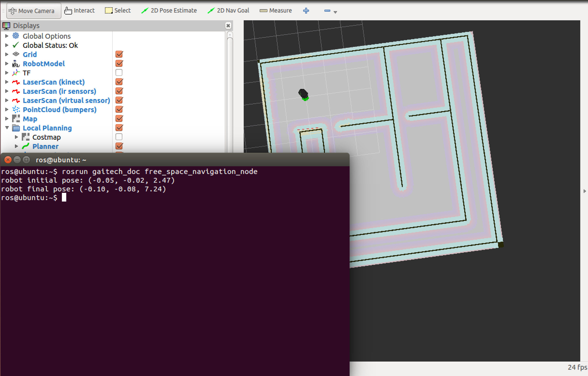

.. _free-space-navigation:

===============================
Turtlebot Free Space Navigation
===============================

This tutorial is the first lesson in the series of robot navigation. We consider the case of an open space with no obstacles. 

The objective of this tutorial is to learn how to make the Turtlebot robot move using ROS. You will mainly learn how to publish a velocity message to make the robot move for a certain distance, or rotate for a certain angle. 
For this, you will create the functions ``move`` and ``rotate`` using different techniques. 
In particular, you will learn how to use ``TF`` package to estimate the distance traveled by the robot and the angle rotated by the robot using frame transformations. 

.. NOTE::

   In this tutorial you will learn how to:

      * Make the robot navigate in an open obstcale-free space
      * Develop functions to make the robot move straight for a certain distance
      * Develop functions to make the robot rotate for a certain angle. 
      * use ``TF`` package to estimate the traveled distance and the rotated angle by a robot

Background
==========
The objective is to develop functions to make the robot moves in an open space in straight line for a certain distance, and rotate left or right for certain angle. 
Using these primitives, it is possible to make the robot move in a free space. 

In :ref:`ros-programming-turtlesim` tutorial, we used the simple equation of ``distance=time*speed`` to make the robot move to a certain distance.
However, this method is not effective in case of a real robot considering the following reason: the inaccuracy of IMU sensor data that provide the speed of the robot in addition to the friction with the ground will 
compromise the accuracy of the calculated traveled distance in a certain time duration, which results in an estimation error. This issue is even worse in case of rotation. This estimation error will quickly cumulate over time leading to inacceptable localization error.  
Fortunately, in ROS, there is the frame transformation package, denoted as ``tf`` package, that provides several interesting and advanced functionalities to estimate the motion of a frame (in this case the frame attached to the robot), with respect to a fixed frame (i.e the reference frame). 
In this tutorial, we will use the ``tf`` package to estimate the traveled distance of the robot, in addition to the rotated angle of the robot. 

 
.. NOTE::

   It is important to have a prior knowledge on frame transformation first to understand the code. Check some online tutorials or ask your instructor. 

Tutorial Files
==============

You can find the whole ``cpp`` and ``python`` files in our `GitHub repository <https://github.com/aniskoubaa/gaitech_doc>`_. 
They are located in ``src/turtlebot/navigation/map_navigation_folder``. 
In particular, we will use the launch file ``map_navigation_psu.launch`` that contains all the needed ROS nodes for this tutorial. 
Here is the content of the ``map_navigation_psu.launch`` file.

You can find the whole ``cpp`` and ``python`` files in our `GitHub repository <https://github.com/aniskoubaa/gaitech_doc>`_. 
They are located in ``src/turtlebot/navigation/free_space_navigation`` folder. 

In the code you will find 3 ``move`` amd ``rotate`` methods and each one of them has its approach so you will be able to know 3 different ways of controlling and manipulating the turtlebot robot . 
The code is also well explained so you can easily understand what each line is doing in the code and what is its functionality.	

   
Anaylzing the code
==================
We first analyze the ``move`` function to make the robot moves with a certain speed for a certain distance in stragight line either forward or backward. 

The following code below sets the linear speed of the x-axis as positive value if the intention is to move forward, and negative value if the robot is to move backward, based on the value of ``isForward`` boolean variable. 
All other linear speeds and angular speeds must be set to zero, because we consider only a straight motion in the x-axis direction. 
It has to be noted that the x-axis of the linear speed is the axis that points to the front of the robot from its center. 

**C++ Code**

.. code-block:: c

    //set the linear velocity to a positive value if isFoward is true
   if (isForward)
      VelocityMessage.linear.x =abs(speed);
   else //else set the velocity to negative value to move backward
      VelocityMessage.linear.x =-abs(speed);
   //all velocities of other axes must be zero.
   VelocityMessage.linear.y =0;
   VelocityMessage.linear.z =0;
   //The angular velocity of all axes must be zero because we want  a straight motion
   VelocityMessage.angular.x = 0;
   VelocityMessage.angular.y = 0;
   VelocityMessage.angular.z =0;

**Python Code**

.. code-block:: python

    if (isForward):
            VelocityMessage.linear.x =abs(speed)
    else: #else set the velocity to negative value to move backward
            VelocityMessage.linear.x =-abs(speed)
    #all velocities of other axes must be zero.
    VelocityMessage.linear.y =0.0
    VelocityMessage.linear.z =0.0
    VelocityMessage.angular.x =0.0
    VelocityMessage.angular.y =0.0
    VelocityMessage.angular.z =0.0

The following code waits for ``tf::TransformListener listener`` to find the transformation between the ``/base_footprint`` frame and the ``/odom`` frame, which represents the reference frame.
Then, once the  the transformation is found between the two frames, we save its current state into the ``init_transform`` which is a ``tf::StampedTransform`` object. 
In simple words, this object captures the relation between the two frames in terms of translation and relative orientation.  

**C Code**

.. code-block:: c
   
   try{
         //wait for the transform to be found
         listener.waitForTransform("/base_footprint", "/odom", ros::Time(0), ros::Duration(10.0) );
         //Once the transform is found,get the initial_transform transformation.
         listener.lookupTransform("/base_footprint", "/odom",ros::Time(0), init_transform);
      }
      catch (tf::TransformException & ex){
         ROS_ERROR(" Problem %s",ex.what());
         ros::Duration(1.0).sleep();
      }

**Python Code**

.. code-block:: python 

      try:
         #wait for the transform to be found
         listener.waitForTransform("/base_footprint", "/odom", rospy.Time(0),rospy.Duration(10.0))
         #Once the transform is found,get the initial_transform transformation.
          listener.lookupTransform("/base_footprint", "/odom", rospy.Time(0),init_transform)
      except Exception:
           rospy.Duration(1.0)

The following code estimates the traveled distance. 
It is known that the distance is ``sqrt((x1-x0)^2 + (y1-y0)^2)``.
``current_transform`` capture the current transformation between the ``/base_footprint`` and ``/odom`` frames. 
Using the ``tf`` function ``getOrigin().x()`` and ``getOrigin().y()`` we can find the ``x`` and ``y`` coordinates
of the frame ``/base_footprint`` with respect to ``/odom`` frame. 
Appying the distance equation, we will be able to find to distance traveled by the robot, 
considering that the ``init_transform`` was captured at the moment before starting the motion and
that the ``current_transform`` was captured at the moment of the motion. 

**C++ Code**

.. code-block:: c
   :emphasize-lines: 15
   
   do{
       /***************************************
       * STEP1. PUBLISH THE VELOCITY MESSAGE
       ***************************************/
      velocityPublisher.publish(VelocityMessage);
      ros::spinOnce();
      loop_rate.sleep();
      /**************************************************
       * STEP2. ESTIMATE THE DISTANCE MOVED BY THE ROBOT
       *************************************************/
      try{
         //wait for the transform to be found
         listener.waitForTransform("/base_footprint", "/odom", ros::Time(0), ros::Duration(10.0) );
         //Once the transform is found,get the initial_transform transformation.
         listener.lookupTransform("/base_footprint", "/odom",ros::Time(0), current_transform);
      }
      catch (tf::TransformException & ex){
         ROS_ERROR(" Problem %s",ex.what());
         ros::Duration(1.0).sleep();
      }
         
         /*
          * Calculate the distance moved by the robot
          * There are two methods that give the same result
          */
   
         /*
          * Method 1: Calculate the distance between the two transformations
          * Hint:
          *      --> transform.getOrigin().x(): represents the x coordinate of the transformation
          *      --> transform.getOrigin().y(): represents the y coordinate of the transformation
          */
         //calculate the distance moved
         distance_moved = sqrt(pow((current_transform.getOrigin().x()-init_transform.getOrigin().x()), 2) +
               pow((current_transform.getOrigin().y()-init_transform.getOrigin().y()), 2));
   
   
      }while((distance_moved<distance)&&(ros::ok()));

**Python Code**

.. code-block:: python
   :emphasize-lines: 16

   while True :
               
        #/***************************************
        # * STEP1. PUBLISH THE VELOCITY MESSAGE
        # ***************************************/
        self.velocityPublisher.publish(VelocityMessage)
        loop_rate.sleep()
        #/**************************************************
        # * STEP2. ESTIMATE THE DISTANCE MOVED BY THE ROBOT
        # *************************************************/
        try:

            #wait for the transform to be found
            listener.waitForTransform("/base_footprint", "/odom", rospy.Time(0), rospy.Duration(10.0) )
            #Once the transform is found,get the initial_transform transformation.
            listener.lookupTransform("/base_footprint", "/odom",rospy.Time(0), current_transform)
        
        except Exception:
            rospy.Duration(1.0)
        
         # Calculate the distance moved by the robot
         # There are two methods that give the same result
         #
         # Method 1: Calculate the distance between the two transformations
         # Hint:
         #    --> transform.getOrigin().x(): represents the x coordinate of the transformation
         #    --> transform.getOrigin().y(): represents the y coordinate of the transformation
         #
         # calculate the distance moved
                    distance_moved = sqrt(pow((current_transform.getOrigin().x()-init_transform.getOrigin().x()), 2) +
                        pow((current_transform.getOrigin().y()-init_transform.getOrigin().y()), 2));

                    if not (distance_moved<distance):
                        break
   

Running the code using Stage and RViz Simulators
================================================

Bring up your simulator:

.. code-block:: bash
	
	roslaunch turtlebot_stage turtlebot_in_stage.launch

If your PC is not fast enough to run the `Stage` with `RViz` you can run only the `Stage` using this command:

.. code-block:: bash
	
	roslaunch turtlebot_stage turtlebot_in_stage_no_rviz.launch

After that run the ``cpp`` node by typing the following command:

.. code-block:: bash
	
	roslaunch gaitech_doc free_space_navigation

or launch the ``free_space_navigation_stage.launch`` file to launch both simulators and the ``cpp`` node.

You can also choose to run the ``python`` script by running this command:

.. code-block:: bash
	
	python your_workspace/src/gaitech_doc/src/turtlebot/navigation/free_space_navigation/script/free_space_navigation.py

.. image:: images/stage-square-move-python.png
	:align: center

.. NOTE::
	
	You can try the three ``move`` methods by calling each one of them in the ``moveSquare`` method.
	You can try the same codes with `Gazebo` simulator but you need to have a fast PC. All you have to do is to launch `Gazebo` by typing the following command:
	
	.. code-block:: bash
	
		roslaunch turtlebot_gazebo turtlebot_world.launch

	Then run either one of the files as mentioned above. 	

.. youtube:: SHPCyqFDr1Q
