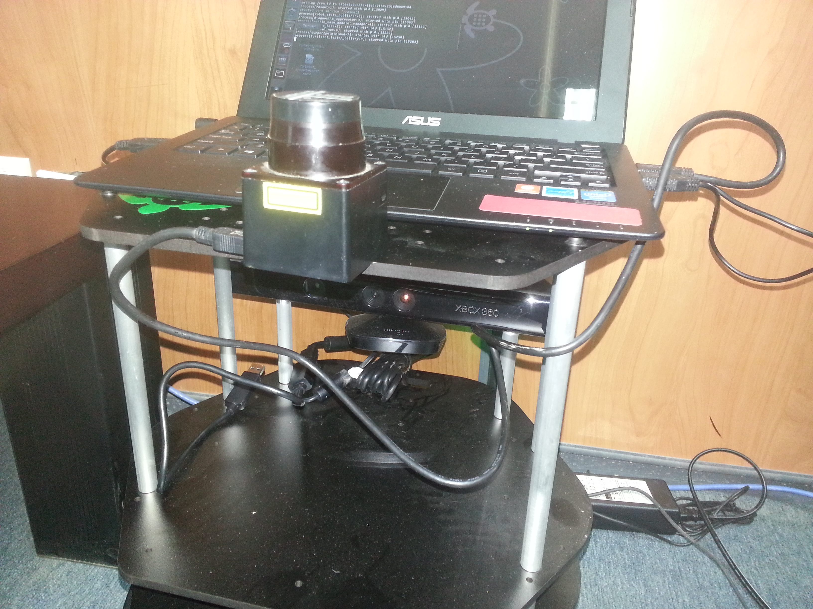

.. _hokuyo-turtlebot:

=============================================
Adding Hokuyo Laser Range Finder to Turtlebot
=============================================

This tutorial presents the steps for adding the `Hokuyo laser range finder <http://www.hokuyo-aut.jp/02sensor/07scanner/urg_04lx_ug01.html>`_ (LRF) sensor to TurtleBot, and explains how to write URDF description of the Hokuyo LRF, and how to modify the `URDF <http://wiki.ros.org/urdf>`_ of the Turtlebot robot to account for the addition of the Hokuyo sensor. Before going through this tutorial, it is highly recommended to have a background on `URDF <http://wiki.ros.org/urdf>`_, and for this you may need to look at `URDF Tutorials <http://wiki.ros.org/urdf/Tutorials>`_. It is also recommended to understand the `URDF Gazebo extensions <http://wiki.ros.org/urdf/Tutorials/UnderstandingPR2URDFGazeboExtension>`_. 

.. NOTE::

   In this tutorial you will learn how to:

      * Download the Hokuyo Related Packages
      * Develop a Hokuyo URDF file
      * Integrate Hokuyo with Turtlebot robot
      * Using SLAM With Hokuyo LIDAR Sensor
      
   This tutorial was developed for ROS `Hydro <http://wiki.ros.org/hydro>`_ version. However, it is expected to also work with `Groovy <http://wiki.ros.org/groovy>`_ (not tested).

The figure below shows the Hokuyo LRF added on top of the Turtlebot. It is possible to add it in other locations, provided that the laser beam do not interfere with the body of the robot.

Installing the Hokuyo Related Packages
======================================

`Hokuyo Node <http://www.hokuyo-aut.jp/02sensor/07scanner/urg_04lx_ug01.html>`_ (UTM-04G) is a laser scanner that can scan with an opening up to 270 degrees with a range up to 4 meters. TurtleBot comes with the Kinect sensor that has a laser scanner with a scan opening up to 57 degrees with practical range of 3 meters. Hokuyo LRF is more accurate than the Kinect sensor and it would be more useful in making maps with gmapping and SLAM applications. 
ROS provides a driver for Hokyuo LRF, referred to as `urg_node <http://wiki.ros.org/hydro>`_ in ROS Hydro distribution. You have to install the `urg_node <http://wiki.ros.org/urg_node>`_ as follows: 

.. code-block:: bash

	sudo apt-get install ros-hydro-urg-*

It is also possible to use the hokuyo_node and for this you need to install `hokuyo_node <http://wiki.ros.org/hokuyo_node>`_ as follows: 

.. code-block:: bash

	sudo apt-get install ros-hydro-hokuyo-node

.. NOTE::
	
	In this tutorial, we used `Hokuyo node <http://wiki.ros.org/hokuyo_node>`_

Copying Hokuyo description in meshes folder
===========================================

After the installation of above package is completed, we should now make the changes in Turtlebot URDF. First we should add the hokuyo.dae file into ``/opt/ros/hydro/share/turtlebot_description/meshes`` folder. Meshes file contain all the properties that are needed to define `hokuyo_node <http://wiki.ros.org/hokuyo_node>`_

.. NOTE:: 
	You need administrative and write privileges to do it

Editing and adding the Hokuyo URDF file
=======================================

Now go the folder ``/opt/ros/hydro/share/turtlebot_description/urdf/sensors`` and create a new file called as ``hokuyo.urdf.xacro``. And add the following lines in the file:

.. code-block:: xml
	
	<?xml version="1.0"?>
	<robot name="sensor_hokuyo" xmlns:xacro="http://ros.org/wiki/xacro">
 	<xacro:include filename="$(find turtlebot_description)/urdf/turtlebot_gazebo.urdf.xacro"/>
	<xacro:include filename="$(find turtlebot_description)/urdf/turtlebot_properties.urdf.xacro"/>
 
 	<xacro:macro name="sensor_hokuyo" params="parent">
    	<link name="laser_joint">
   	<collision>
    	<origin xyz="0 0 0" rpy="0 0 0"/>
    	<geometry>
        <box size="0.1 0.1 0.1"/>
    	</geometry>
   	</collision>
   	<visual>
    	<origin xyz="0 0 0" rpy="0 0 0"/>
    	<geometry>
        <mesh filename="package://turtlebot_description/meshes/sensors/hokuyo.dae"/>
    	</geometry>
   	</visual>
   	<inertial>
    	<mass value="1e-5" />
    	<origin xyz="0 0 0" rpy="0 0 0"/>
    	<inertia ixx="1e-6" ixy="0" ixz="0" iyy="1e-6" iyz="0" izz="1e-6" />
   	</inertial>
 	</link>
 	<joint name="hokuyo_joint" type="fixed">
   	<axis xyz="0 0 1" />
   	<origin xyz="0 0.22 0.05" rpy="0 0 1.570796"/>
   	<parent link="${parent}"/>
   	<child link="laser"/>
 	</joint>
 	</xacro:macro>
  	</robot>

Code Explanation
================

The code focuses on two things one is description about `Hokuyo <http://www.hokuyo-aut.jp/02sensor/07scanner/urg_04lx_ug01.html>`_ that is in ``meshes`` folder, and other is the defining join with its location and its relation with parent frame (joint). For finding the location of hokuyo sensor, you may need to calculate the location that will be in meters and the representation is in ``x,y,z`` . Turtlebot assumes ``0 0 0`` at it base center.

.. code-block:: xml
	
	<collision>
     	<origin xyz="0 0 0" rpy="0 0 0"/>
     	<geometry>
        <box size="0.1 0.1 0.1"/>
     	</geometry>
   	</collision>

Collision do provide the opportunity to take a decision before going to collide.In above code we have defined collisions for more explanation look into `Adding Collisions <http://wiki.ros.org/urdf/Tutorials/Adding%20Physical%20and%20Collision%20Properties%20to%20a%20URDF%20Model>`_.It is necessary to set the parameters to avoid collisions.

.. code-block:: xml
	
	<joint name="hokuyo_joint" type="fixed">
   	<axis xyz="0 0 1" />
   	<origin xyz="0 0.22 0.05" rpy="0 0 1.570796"/>
   	<parent link="${parent}"/>
   	<child link="laser"/>
   	</joint>

In above code, first thing we did is specifying the joint name that is Hokuyo (but can be changed to any other thing), the type we select as ``fixed`` then we defined where the Hokuyo is attached with respect to origin, Next thing the joints are defined by parent and child, You can also specify some fixed frame like ``map`` or ``base_footprint`` or make it link to default parent

Adding Hokuyo URDF description to Turtlebot URDF description
============================================================

In order to be Hokuyo a part of URDF description, we need to add Hokuyo LRF description to the Turtlebot URDF so that it can be visualized in rivz and other simulators. For that purpose, go to the folder ``/opt/ros/hydro/share/turtlebot_description/urdf`` and add the following line in ``turtlebot_library.urdf.xacro`` file:

.. code-block:: xml
	
	<xacro:include filename="$(find turtlebot_description)/urdf/sensors/hokuyo.urdf.xacro"/>

This will call the hokuyo description created in urdf. In order to launch the description , it is just required to launch ``mininal.launch`` and it will work, in order to see a hokuyo sensor in rviz we need to add its definition in gazebo that is not covered in this tutorial but can be borrowed from `Building Visual Robot <http://wiki.ros.org/urdf/Tutorials/Building%20a%20Visual%20Robot%20Model%20with%20URDF%20from%20Scratch>`_

Creating a Launch File for Hokuyo Node
======================================

Its is better to create a Hokuyo Launch file in order to launch the Hokuyo node. It will also allow Hokuyo node dynamic re-configuration of Hokuyo node. Create a launch file in any package and call it as ``hokuyo.launch``. Copy and paste the following code in ``hokuyo.launch``

.. code-block:: bash

	<launch>
   	<node name="hokuyo" pkg="hokuyo_node" type="hokuyo_node" respawn="false" output="screen">
   	<param name="calibrate_time" type="bool" value="true"/> 
   	<param name="port" type="string" value="/dev/ttyACM0"/> 
   	<param name="intensity" type="bool" value="false"/>
   	<param name="min_ang" value="-2.356194437"/>   
   	<param name="max_ang" value="2.35619443"/>    
   	<param name="cluster" value="1"/>
   	</node>
   	</launch>

Using SLAM With Hokuyo LIDAR Sensor
===================================

In order to use Hokuyo for SLAM as described in tutorial `Building SLAM <http://wiki.ros.org/turtlebot_navigation/Tutorials/Build%20a%20map%20with%20SLAM>`_ hokuyo-turtlebot. Following are the steps to be done at turtlebot Launch the Turtlebot

.. code-block:: bash

    roslaunch turtlebot_bringup minimal.launch

run the Hokuyo node:

.. code-block:: bash

	roslaunch turtlebot_test_launch hokuyo.launch

Launch the ``gmapping`` for map building

.. code-block:: bash

	roslaunch turtlebot_navigation gmapping_demo.launch 

You can view the map at workstation using ``rviz``

.. code-block:: bash

    roslaunch turtlebot_rviz_launchers view_navigation.launch

.. NOTE::

   Learn ROS and get your ROS certificate by enrolling in the Udemy course 
   `ROS for Beginners: Basics, Motion and OpenCV. <https://www.udemy.com/ros-essentials/?couponCode=ROS1GAITECHEDU>`_

   Learn about ROS2: ROS Next Generation by enrolling in the Udemy course
   `ROS2 How To: Discover Next Generation ROS <https://www.udemy.com/ros2-how-to/?couponCode=ROS2GAITECHEDU>`_
