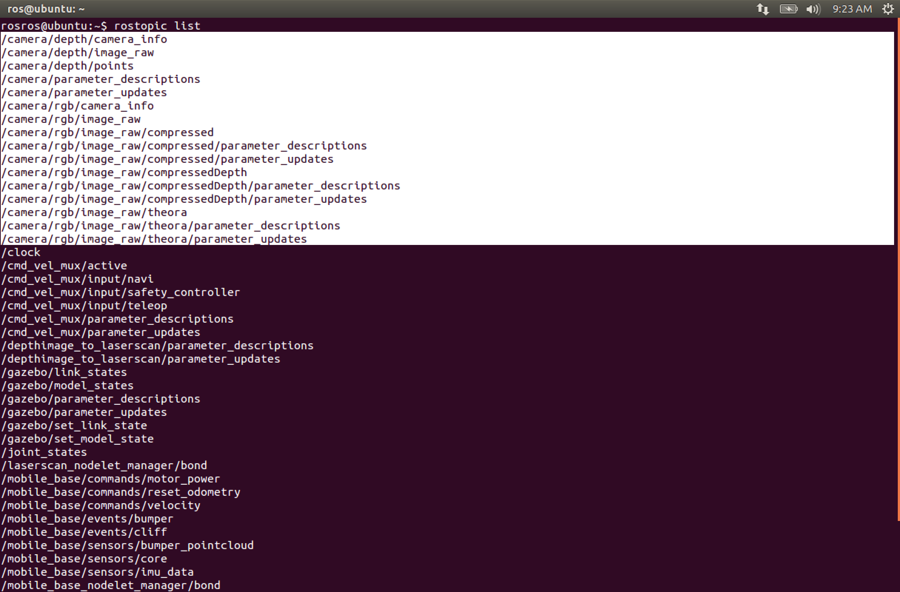

.. _line-follower:

=======================
Turtlebot Line Follower
=======================

This tutorial will introduce how to control your turtlebot robot to follow a line using the ``cv_bridge`` package.

.. WARNING::
    Make sure that you completed installing all the required packages in the previous tutorials and your network set-up is working fine between the ROS Master node and the host node.

.. NOTE::

   In this tutorial you will learn how to:

      * Teleoprate a real and simulated turtlebot with line following program
      * Create your own path
      * Test your program on Gazebo Simulator

The ``cv_bridge`` package is used to convert images coming on the topic ``sensor_msgs/Image`` to messages that ``OpenCV`` can open and display them.

Introducing the OpenCV
======================

OpenCV is a popular open source computer vision library. We will use this library to view images and stream from the turtlbot robot so it can follow a line on the ground. In order to do that we will need to see the line, define the centre of this line and finally move the robot to follow the robot.
Messages from the camera are published on the ``the sensor_msgs/Image`` topic so we will need to write a node that subscribe to the same topic.

Open any text editor you like and type the following in a file called ``follower.py``:

.. code-block:: python

	#!/usr/bin/env python
	import rospy
	from sensor_msgs.msg import Image

	def image_callback(msg):
		pass

	rospy.init_node('follower')
	image_sub = rospy.Subscriber('camera/rgb/image_raw', Image, image_callback)
	rospy.spin()

This a very simple subscriber node that does nothing. 
Run the following commands:

.. code-block:: bash
	
	roscore
Start up your Gazebo simulator:

.. code-block:: bash

	roslaunch turtlebot_gazebo turtlebot_world.launch

then type this command to see all the topics published so far.

.. code-block:: bash

	rostopic list 

You will see something like the following.

We are only interested about the ``camera`` topics.

Now run your python script:

.. code-block:: bash

	python your_path/follower.py

To be able to make sure that it is working run the following command:

.. code-block:: bash

	rosnode list

This will give you a list of all the active nodes on your ROS environment and you will find your ``follower`` node between them.

Now you need to create a ``python`` script to view the images from the turtlebot. Save the following ``python`` script in a file called ``follower_opencv.py`` :

.. code-block:: python
	
	#!/usr/bin/env python

	#This script uses the cv_bridge package to convert images coming on the topic
	#sensor_msgs/Image to OpenCV messages and display them on the screen

	import rospy
	from sensor_msgs.msg import Image
	import cv2, cv_bridge
	class Follower:
		def __init__(self):
			self.bridge = cv_bridge.CvBridge()
			cv2.namedWindow("window", 1)
			self.image_sub = rospy.Subscriber('camera/rgb/image_raw',
			Image, self.image_callback)
	
		def image_callback(self, msg):
			image = self.bridge.imgmsg_to_cv2(msg,desired_encoding='bgr8')
			cv2.imshow("window", image)
			cv2.waitKey(3)
	rospy.init_node('follower')
	follower = Follower()
	rospy.spin()

Run the ``python`` script after saving the changes. You will be able to see an image of whatever infront of the robot.

Draw a line in Gazebo
=====================

Install the full version of `Gazebo Simulator <http://gazebosim.org/download>`_ and draw a yellow line using the tutorials provided on the website. 

Follow the line
===============

After drawing the yellow line we need to make the robot follow this line. The apprach that is used here is for the robot the follow the line after defining the center of the line and draw a red dot at the center point of the line and keep this dot at 1 meter distance from the robot. Then move the robot according to the line path.

Open a new file and call it ``line_follower.py`` and write the following script:

.. code-block:: python

	#!/usr/bin/env python

	#This Program is tested on Gazebo Simulator
	#This script uses the cv_bridge package to convert images coming on the topic
	#sensor_msgs/Image to OpenCV messages and then convert their colors from RGB to HSV
	#then apply a threshold for hues near the color yellow to obtain the binary image 
	#to be able to see only the yellow line and then follow that line
	#It uses an approach called proportional and simply means 

	import rospy, cv2, cv_bridge, numpy
	from sensor_msgs.msg import Image
	from geometry_msgs.msg import Twist

	class Follower:

		def __init__(self):
		
			self.bridge = cv_bridge.CvBridge()
			cv2.namedWindow("window", 1)
		
			self.image_sub = rospy.Subscriber('camera/rgb/image_raw',
				Image, self.image_callback)
		
			self.cmd_vel_pub = rospy.Publisher('cmd_vel_mux/input/teleop',
				Twist, queue_size=1)
		
			self.twist = Twist()

		def image_callback(self, msg):

			image = self.bridge.imgmsg_to_cv2(msg,desired_encoding='bgr8')
			hsv = cv2.cvtColor(image, cv2.COLOR_BGR2HSV)
			lower_yellow = numpy.array([ 10, 10, 10])
			upper_yellow = numpy.array([255, 255, 250])
			mask = cv2.inRange(hsv, lower_yellow, upper_yellow)
		
			h, w, d = image.shape
			search_top = 3*h/4
			search_bot = 3*h/4 + 20
			mask[0:search_top, 0:w] = 0
			mask[search_bot:h, 0:w] = 0

			M = cv2.moments(mask)
			if M['m00'] > 0:
				cx = int(M['m10']/M['m00'])
				cy = int(M['m01']/M['m00'])
				cv2.circle(image, (cx, cy), 20, (0,0,255), -1)
	#The proportional controller is implemented in the following four lines	which
	#is reposible of linear scaling of an error to drive the control output.	
				err = cx - w/2
				self.twist.linear.x = 0.2
				self.twist.angular.z = -float(err) / 100
				self.cmd_vel_pub.publish(self.twist)
			cv2.imshow("window", image)
			cv2.waitKey(3)

	rospy.init_node('line_follower')
	follower = Follower()
	rospy.spin()

Open `Gazebo` and then run the ``python`` script:

.. code-block:: bach
	
	python your_path/line_follower.py

Test on your Turtlebot
======================

Draw a yellow line on your ground using a colored paper or a ducktape.

.. NOTE::
	Make sure that the color ground's color is different than the yellow color you are using to avoid conflict and ensure good results.
	
On your master node(turtlebot PC) run the following commands:

.. code-block:: bach
	
	roscore
	roslaunch turtlebot_bringup minimal.launch

on your host node(your PC) run the ``python`` script:

.. code-block:: bach
	
	python your_path/line_follower.py
