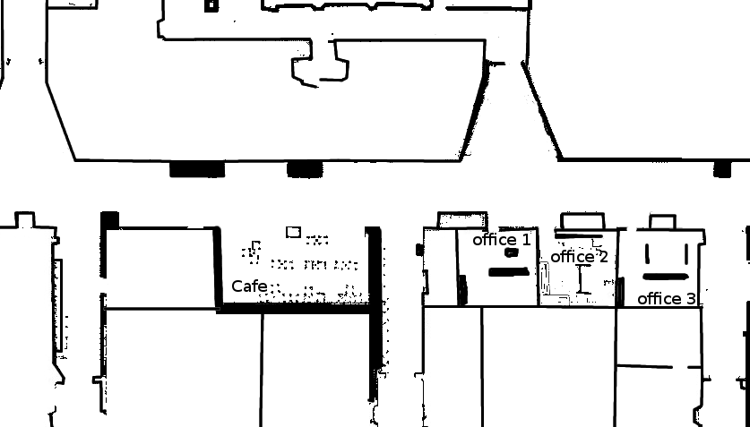
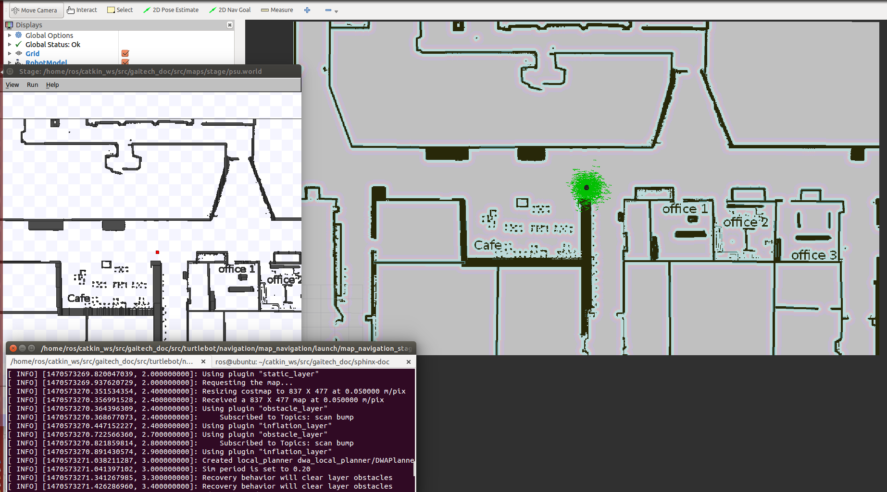
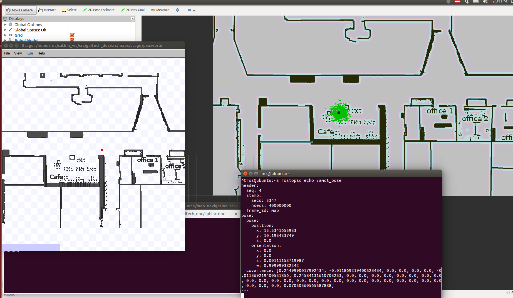

.. _send-goals-nav-stack:

====================
Map-Based Navigation
====================

In this tutorial, you will learn about map-based navigation in ROS. You will be able to develop a ROS program in C++ and Python that will allow you to define goal locations for the robot and then send these goal locations to the navigation stack to execute the mission and head towards the goal. 
Note that it is possible to do so with rviz, but in this tutorial, you will be able to do this programmatically. 
You will also learn how to configure ``ros stage`` simulation to use a map of your choice and perform a navigation mission in the select map. 


.. TIP:: 
    At the end of this tutorial, you will be able to:
    
    * Understand how map-based navigation is performed in ROS.
    * Develop a ROS program that defines goal locations programmatically and send them to the navigation stack
    * Configure the ROS ``stage`` Turtlebot simulator to  use a particular map of interest
    * Use ``sound_play`` ROS package to play sound in a ROS application. 

Background
==========
The objective of this tutorial is to use a map of interest and request the robot to go to certain locations on that map. 
In the previous tutorial :ref:`create-map`, you already learned how to build a map with the Turtlebot. You will learn how to use such a map to program navigation missions for the robot.
Remember that a map in ROS consists of two files, namely a ``.yaml`` file that contains information about the map, and a ``.pgm`` file that contains the map itself. 
In this tutorial, we are going to consider the following University floor map to develop our navigation example



**Figure 1. University Floor Map**

Later on, as an exercise, you will use your own map to develop a navigation mission for your Turtlebot. 

In the map of Figure 1, we identify four locations of interests namely, the Cafe area, Office1, Office2 and Office3. Other locations can also be defined, but we just used these representative four locations for illustration purposes. 
If we want to develop a ROS program that allow the robot to navigate to those locations, we first need to know what are the ``(x,y)`` coordinate of these locations onto the map. This is what will be explained later. 
Then, we use these coordinates to define a navigation mission that we submit to the robot's navigation stack to execute it. 
Remember that any robot on ROS runs the ``move_base`` navigation stack which allow the robot to find a path towards a goal and execute the path following while avoiding obstacles. Refer to :ref:`navigation-stack` for a refresher. 

Tutorial Files
==============
You can find the whole ``cpp`` and ``python`` files in our `GitHub repository <https://github.com/aniskoubaa/gaitech_doc>`_. 
They are located in ``src/turtlebot/navigation/map_navigation_folder``. 
In particular, we will use the launch file ``map_navigation_psu.launch`` that contains all the needed ROS nodes for this tutorial. 
Here is the content of the ``map_navigation_psu.launch`` file.


.. code-block:: xml
   
   <launch>
         <include file="$(find gaitech_doc)/src/turtlebot/navigation/map_navigation/launch/turtlebot_stage_psu.launch"/>
        <node name="map_navigation" pkg="gaitech_doc" type="map_navigation_node" output="screen">
        </node>
        <node name="playing_sound_node" pkg="sound_play" type="soundplay_node.py" output="screen">
        </node>
   </launch>

We observe that there are three nodes:

   * The first one includes the ``turtlebot_stage_psu.launch`` file, which starts-up the Turtlebot simulated robots in the stage simulator. This file initialize several parameters related to the inital position of the robot and the maps that will be used. Here is a partial snapshot of this file:
   
.. code-block:: xml
   
   <launch>
     <arg name="base"       default="$(optenv TURTLEBOT_BASE kobuki)"/>  <!-- create, rhoomba -->
     <arg name="stacks"     default="$(optenv TURTLEBOT_STACKS hexagons)"/>  <!-- circles, hexagons -->
     <arg name="3d_sensor"  default="$(optenv TURTLEBOT_3D_SENSOR kinect)"/>  <!-- kinect, asus_xtion_pro -->
   
     <!-- Name of the map to use (without path nor extension) and initial position -->
     <arg name="map_file"       default=" $(find gaitech_doc)/src/maps/psu.yaml"/> <!-- psu -->
     <arg name="world_file"     default=" $(find gaitech_doc)/src/maps/stage/psu.world"/>
     <arg name="initial_pose_x" default="20.925"/>
     <arg name="initial_pose_y" default="11.925"/>
     <arg name="initial_pose_a" default="0.0"/>
      ...
      ...


You can observe that this launch files defines the ``map_file``, that is the ``yaml`` file that defines the map that will be used by the navigation stack, and displayed by ``rviz``.
In addition, it defines the ``world_file`` that is ``world`` file that defines also a map used by the ``stage`` simulator.  
Furthermore, ``initial_pose_x`` and ``initial_pose_y`` define the initial location of the robot in terms of x-coordinate and y-coordinate respectively. 
How to determine this initale location and locations of interest will be described in details in the next section of this tutorial. 

 * The second node if the ``map_navigation_node`` that is the ROS program that we are going to develop to make the robot travel to  certain location of interest. The program is developed in the file ``map_navigation.cpp`` in C++ and ``map_navigation.py`` in python
 * the third node, is optional, and represent the ``sound_play`` node that allow to make sound notification in a ROS program.  
   
.. _find-locations:

Finding the Coordinates for Locations of Interest
=================================================
The first thing you need to do is to find the location of the locations where you want the robot to go. 
These locations depends on the map size and resolutions. 
The easiest way to do so is to use ``rviz`` to visualize the map and then getting the coordinate using the ``2D Pose Estimate`` button.   
Let us start the Turtlebot simulator with the University floor map as follow:

.. code-block:: bash

   roslaunch gaitech_doc map_navigation_stage_psu.launch
   
The simulator will open. Try to arrange the ``stage`` simulation, ``rviz`` and the command terminal as in the following picture for better visibility:



**Figure 2: Turtlebot Simulation Environment**

Now, you want to find the coordinate of any location of interest. open another terminal and write

.. code-block:: bash

   rostopic echo /amcl_pose

This command will display any new ``/amcl_pose``, which is the ROS topic represents the location of the robot on the map. 
Now, click on ``2D Pose Estimate`` button, then click on any location of interest on the map. 
Go back to the terminal where wrote ``rostopic echo /amcl_pose``, and you will find the coordinate of the point select as in the following figure:



**Figure 3: Finding the Location of Interest**

Take note of the ``(x,y)`` coordinates for the Cafe and the three offices. They should be close to these values:

.. code-block:: c

   Cafe (15.50, 10.20)
   Office1 (27.70,12.50)
   Office2 (30.44,12.50)
   Office3 (35.20,12.50)

The following video demonstrates the whole process.

.. youtube:: sWFDk1BxsyA


Writing the navigation program
==============================
Now, we are ready to write a program that allows the robot to navigate to the goal location. 
Here is the snapshot of the code in C++:

.. code-block:: c
   :linenos:

   #include <ros/ros.h>
   #include <move_base_msgs/MoveBaseAction.h>
   #include <actionlib/client/simple_action_client.h>
   #include "sound_play/sound_play.h"
   
   std::string path_to_sounds;
   
   /** function declarations **/
   bool moveToGoal(double xGoal, double yGoal);
   char choose();
   
   /** declare the coordinates of interest **/
   double xCafe = 15.50;
   double yCafe = 10.20;
   double xOffice1 = 27.70 ;
   double yOffice1 = 12.50;
   double xOffice2 = 30.44 ;
   double yOffice2 = 12.50;
   double xOffice3 = 35.20 ;
   double yOffice3 = 13.50;
   
   bool goalReached = false;
    int main(int argc, char** argv){
      ros::init(argc, argv, "map_navigation_node");
      ros::NodeHandle n;
      sound_play::SoundClient sc;
      ros::spinOnce();
      path_to_sounds = "/home/ros/catkin_ws/src/gaitech_doc/src/sounds/";
   
      char choice = 'q';
      do{
         choice =choose();
         if (choice == '0'){
            goalReached = moveToGoal(xCafe, yCafe);
         }else if (choice == '1'){
            goalReached = moveToGoal(xOffice1, yOffice1);
         }else if (choice == '2'){
            goalReached = moveToGoal(xOffice2, yOffice2);
         }else if (choice == '3'){
            goalReached = moveToGoal(xOffice3, yOffice3);
         }
         if (choice!='q'){
            if (goalReached){
               ROS_INFO("Congratulations!");
               ros::spinOnce();
               sc.playWave(path_to_sounds+"ship_bell.wav");
               ros::spinOnce();
   
            }else{
               ROS_INFO("Hard Luck!");
               sc.playWave(path_to_sounds+"short_buzzer.wav");
            }
         }
      }while(choice !='q');
      return 0;
   }

The program strucure is very simple. 
The user is requested to press a key, and based on his selection, the defined method ``moveToGoal(x,y)`` will be executed, 
where ``x`` and ``y`` define the coordinates of the locations of interest. 
Lines 13-20 define the location of points of interest that we determined in the last section :ref:`find-locations`.
Then, from lines 42-51, if the goal is successully reached, the program will display ``congratulations`` text message and will plan a ``ship_bell`` sound.
Otherwise, it will display ``hard luck`` message and will play the ``short buzzer`` sound.

Now, let us focus more on how the method  ``moveToGoal(x,y)`` is implemented. Here is the code.

.. code-block:: c
   :linenos:

   bool moveToGoal(double xGoal, double yGoal){
   
      //define a client for to send goal requests to the move_base server through a SimpleActionClient
      actionlib::SimpleActionClient<move_base_msgs::MoveBaseAction> ac("move_base", true);
   
      //wait for the action server to come up
      while(!ac.waitForServer(ros::Duration(5.0))){
         ROS_INFO("Waiting for the move_base action server to come up");
      }
   
      move_base_msgs::MoveBaseGoal goal;
   
      //set up the frame parameters
      goal.target_pose.header.frame_id = "map";
      goal.target_pose.header.stamp = ros::Time::now();
   
      /* moving towards the goal*/
   
      goal.target_pose.pose.position.x =  xGoal;
      goal.target_pose.pose.position.y =  yGoal;
      goal.target_pose.pose.position.z =  0.0;
      goal.target_pose.pose.orientation.x = 0.0;
      goal.target_pose.pose.orientation.y = 0.0;
      goal.target_pose.pose.orientation.z = 0.0;
      goal.target_pose.pose.orientation.w = 1.0;
   
      ROS_INFO("Sending goal location ...");
      ac.sendGoal(goal);
   
      ac.waitForResult();
   
      if(ac.getState() == actionlib::SimpleClientGoalState::SUCCEEDED){
         ROS_INFO("You have reached the destination");
         return true;
      }
      else{
         ROS_INFO("The robot failed to reach the destination");
         return false;
      }
   
   }


Line 4 defines a client that is responsible for sending navigation goal request to the ``move_base`` server.
In fact, the navigation stack of ROS has a ``MoveBaseAction`` action server  that receives navigation goals request, 
and then finds a global path from the robot location to the goal location through the ``Global Path Planner``, 
and once a path is found, it executes the path while avoiding obstacle through the ``Local Path Planner`` until it reaches the destination or fails to do so for any reason (like unexpected obstacle found on path).

Lines 7-8 will wait until it finds the action server and will not proceed longer until it makes sure that it is alive and will receive navigation requests. 
This is in fact a blocking instruction. 

Line 11 defines a goal location and lines 13-25 specify the parameters of that location. 
It is easy to understand that lines 19-25 define the coordinates for the goal location. 
In particular the orientation component values expressed in `quaternion <https://en.wikipedia.org/wiki/Quaternion>`_ refers to a heading equal to zero degrees.

Lines 14-15 are extremely important, in particular line 14.
Line 14  ``goal.target_pose.header.frame_id = "map"`` specifies the reference frame for that location. In this example, it is specified as the ``map`` frame, which simply means that the coordinates will be considered in the global reference frame related to the map itself.
In other words, it is the **absolute position** on the map.
In case where the reference frame is set with respect to the robot, namely ``goal.target_pose.header.frame_id = "base_link"``  (like in `this tutorial <http://wiki.ros.org/navigation/Tutorials/SendingSimpleGoals>`_), the coordinate will have a completely other meaning. 
In fact, in this case the coordinate will represent the ``(x,y)`` coordinate with respect to robot base frame attached to the robot, so it is a **relative position** rather than a **absolute position** as in the case of using the ``map`` frame. 

Line 15 adds a timestamp to the goal location. 

Line 28 sends the goal location request to the ``move_base`` action server, and wait for its execution as shown in line 31 (``ac.waitForResult()``).
Note that this request is **sychrounous**, which means it will block until the result is sent back to the requesting client object. After it finishes, we can check if the goal succeded or failed and output a message to the user accordingly.

In what follow, we present the equivalent code in Python, which does exactly the same thing:

.. code-block:: c
   :linenos:
   
   ADD PYTHON CODE HERE

Playing sounds
--------------
To add some animation to this example, we used the ROS package ``sound_play`` which allows to play sound files. 
Observe that we included the C library for the sound plan in line 4 of the first code above.
Furthermore, to be able to play sounds, it is necessary to start the ROS node, which was already done in the ``map_navigation_psu.launch``. Without this node, no sound can be played.

In the program, we create a sound client with ``sound_play::SoundClient sc;`` and also we defined the absolute path to sound files with ``path_to_sounds = "/home/ros/catkin_ws/src/gaitech_doc/src/sounds/"``.

Then, we use the method ``sc.playWave(path_to_the_sound_file)`` to play a certain sound file. For example, in case of successul mission, the sound is played with ``sc.playWave(path_to_sounds+"ship_bell.wav");``.

Testing the code
================

To test the above example, you simply need to execute the command

.. code-block:: bash
   
   roslaunch gaitech_doc map_navigation_stage_psu.launch

Then, on the terminal command, you enter the location of your choice based on the selection menu and observe how the robot navigates to the goal location.

Congratulation! You now know how to program navigation mission for your simulated Turtlebot. 


Testing with Your Own Map on Simulation and Real Robot
======================================================

It is easy to apply the navigation code on a real robot. 
However, you should deploy it using the map of the environment where you are going to run the experiments.

First, using the instructions of the :ref:`create-map` tutorial, create the map of your experimental environment.

Now, you need to make changes to the launch and world files to consider the information of the map of your environment. Follow these steps:

   * Step 1. Put the  ``.yaml`` and ``.pgm``  map files in the ``src/maps/`` folder. Let us assume they are called ``mymap.yaml`` and ``myamap.pgm``.
   * Step 2. In the ``src/turtlebot/navigation/map_navigation/launch/`` folder, make a copy of the two files ``map_navigation_stage_psu.launch`` and ``turtlebot_stage_psu.launch`` and give them other names, for example ``map_navigation_maymap.launch`` and ``turtlebot_stage_mymap.launch``. We will use these two files to launch the simulator with your own map. 
   * Step 3. In the new file, ``map_navigation_maymap.launch``, change ``turtlebot_stage_psu.launch`` with ``turtlebot_stage_mymap.launch``. This mean you will start the Turtlebot simulator with the parameters of your map. For this, you need to make the following changes to the  ``turtlebot_stage_mymap.launch``
   * Step 4. Change the name of the map and world files in ``turtlebot_stage_mymap.launch`` file as follow:
   
.. code-block:: xml
   :linenos:
   :emphasize-lines: 7,8,9,10
   
   <launch>
     <arg name="base"       default="$(optenv TURTLEBOT_BASE kobuki)"/>  <!-- create, rhoomba -->
     <arg name="stacks"     default="$(optenv TURTLEBOT_STACKS hexagons)"/>  <!-- circles, hexagons -->
     <arg name="3d_sensor"  default="$(optenv TURTLEBOT_3D_SENSOR kinect)"/>  <!-- kinect, asus_xtion_pro -->
   
     <!-- Name of the map to use (without path nor extension) and initial position -->
     <arg name="map_file"       default=" $(find gaitech_doc)/src/maps/mymap.yaml"/> <!-- psu -->
     <arg name="world_file"     default=" $(find gaitech_doc)/src/maps/stage/mymap.world"/>
     .....

    

* Step 5. Now, you need to edit the file ``mymap.world`` file. This file is used by ``stage`` to display the map. In the folder, ``src/maps/stage/``, Make a copy of ``psu.world``, change its name to ``mymap.world`` and open it with ``gedit``.


.. code-block:: yaml
   :linenos:
   :emphasize-lines: 4,5,6,7,12
   
   ...
   floorplan
   (
     name "mymap"
     bitmap "../mymap.pgm"
     size [ map_width map_length 0.0 ] #the real size in meters (from yaml, resolution*pixels)
     pose [ width_offset length_offset 0.0 0.0 ]
   )
   
   # throw in a robot
   turtlebot
   (
     pose [x_init y_init 0.0 0.0 ]
     name "turtlebot"
     color "red"
   )
    .....


First, change ```psu`` and ``psu.pgm`` in Lines 4 and 5 as shown. Line 4 assigns a name to the floor plan, and Line 5 refer to the map itself, in our case ``mymap.pgm``.
Finding the size is important. The size can be determined from two information from the ``yaml`` file, namely, the ``resolution`` and the ``pixel width`` and the ``pixel length``.
For example, in case of ``psu.yaml`` file, we have a ``resolution = 0.05`` and from the ``pgm`` file, the image of the map has  ``(837*477) (pixels^2)``.
Multiplying by the resolution, we get the size of the map as ``(41.85 * 23.85) m^2``. So,in the case of psu map, width_map = 41.85 m and length_map=23.85 m.

For the width and length offsets, we generally set them to the half of the width and length respectively, in this case will be ``(20.925, 11.925)``.
Then you set the initial position of the robot of your choice. For this, you can choose any position that would not conflict with an obstacle. 

In case of psu, we set the initial position to the center of the map ``(20.925, 11.925)`` as a choice. Other choices would also work. 

* Step 5. finally, make sure to put the same initial location in the file ``map_navigation_maymap.launch``,

.. code-block:: xml
   :linenos:
   :emphasize-lines: 9,10,11
   
   <launch>
     <arg name="base"       default="$(optenv TURTLEBOT_BASE kobuki)"/>  <!-- create, rhoomba -->
     <arg name="stacks"     default="$(optenv TURTLEBOT_STACKS hexagons)"/>  <!-- circles, hexagons -->
     <arg name="3d_sensor"  default="$(optenv TURTLEBOT_3D_SENSOR kinect)"/>  <!-- kinect, asus_xtion_pro -->
   
     <!-- Name of the map to use (without path nor extension) and initial position -->
     <arg name="map_file"       default=" $(find gaitech_doc)/src/maps/mymap.yaml"/> <!-- psu -->
     <arg name="world_file"     default=" $(find gaitech_doc)/src/maps/stage/mymap.world"/>
     <arg name="initial_pose_x" default="x_init"/>
     <arg name="initial_pose_y" default="y_init"/>
     <arg name="initial_pose_a" default="0.0"/>

Now, you should be able to run the simulator with your own map. 

Running on a real robot
-----------------------
To deploy on a real robot, you simply need to bring-up your turtlebot robot, and then execute the ``map_navigation_node`` either on the robot machine (not recommended) or on your workstation (recommended).
In the latter case, You must make sure to have correctly configured your network settings as explained in the :ref:`network-config-doc` tutorial.  

References
==========

TODO: CREATE LINKS FOR THESE REFERENCES
   * Map Server in ROS
   * ROS Navigation
   * Global Planner
   * Local Planner
   * ROS Navigation Tutorials
  
  