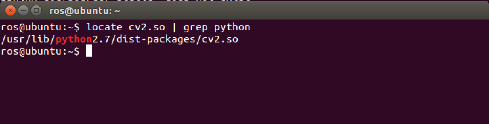

.. _openCV-turtlebot:

=========================
ROS OpenCV with Turtlebot
=========================

In this tutorial you will learn how to configure your turtlebot robot with OpenCV to stream videos from Microsoft Kinect. 

.. WARNING::
    * Make sure that you completed installing all the required packages in the previous tutorials, your network set-up is working fine between the ROS Master node and the host node.
    * Make sure to complete the ROS OpenKinect with Turtlebot tutorial. 

Installing OpenCV packages
==========================

You need to download the OpenCV packages by running the following commands:

.. code-block:: bash

	sudo apt-get install ros-indigo-vision-opencv libopencv-dev \ python-opencv
	rospack profile

After installation type this command to make sure that you have successfully installed the packages:

.. code-block:: bash
	
	$ python
	>>> from cv2 import cv
	>>> quit()

You can type the following command to make sure that the OpenCV Python library is installed in its proper location:

.. code-block:: bash

	locate cv2.so | grep python

You will get an output like this:

