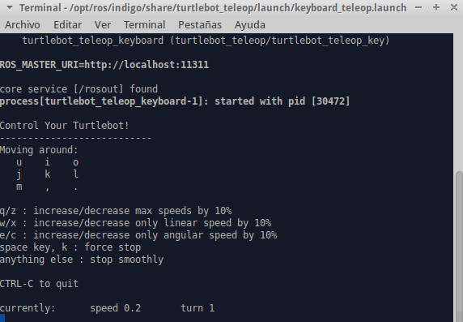

.. _teleop-doc:

===============
Keyboard Teleop
===============

This tutorial will introduce to you how to control your turtlebot robot using ssh or across the wireless communication with your keyboard.

.. NOTE::
  Make sure that you completed installing all the required packets in the previous tutorials and your network is working fine between the ROS Master node and the host node.

On the Master node run the following command:

``roslaunch turtlebot_bringup minimal.launch``

On your PC (the host node) run the following command:

``roslaunch turtlebot_teleop keyboard_teleop.launch``

You can move you turtlebot robot according to the instructions below:

.. NOTE::
    Make sure that your turtlebot robot is on a flat surface and on a safe distance from an edge.

Code Explanation
================

This is the script of the keyboard_teleop.launch file:

.. code-block:: python

    <launch>
     <!-- turtlebot_teleop_key already has its own built in velocity smoother -->
      <node pkg="turtlebot_teleop" type="turtlebot_teleop_key" name="turtlebot_teleop_keyboard"  output="screen">
       <param name="scale_linear" value="0.5" type="double"/>
       <param name="scale_angular" value="1.5" type="double"/>
       <remap from="turtlebot_teleop_keyboard/cmd_vel" to="cmd_vel_mux/input/teleop"/>
      </node>
   </launch>

Notice that the keyboard teleop node takes two parameters(scale_linear and scale_angular) and they are used to determine the speed of the turtlebot speed. It is very important to keep the speed very small when you are testing. However, you can change the speed value as much as you like.

You can do the same tutorial to control your turtlebot robot using a PlayStation3 `Joystick <http://wiki.ros.org/turtlebot_teleop/Tutorials/indigo/Joystick%20Teleop>`_ .
