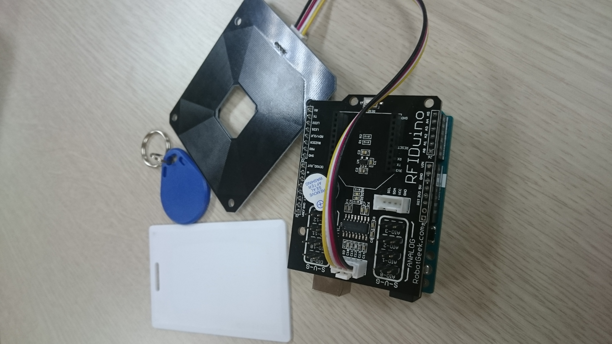

.. _turtlebot-arm-arduino:

============================================================
Controlling a Turtlebot Arm with an Arduino Board using RFID
============================================================

This tutorial is the step to learn about how to integrate the Turtlebot robot with the Arm PhantomX Pincher using ROS and Arduino UNO board.

.. NOTE::

   In this tutorial you will learn how to:

      * Download the necessary packages
      * Get the required components
      * Develop a program to control the Arm robot with the Arduino board
      * Test your program 
      
	This tutorial was developed for ROS `Hydro <http://wiki.ros.org/hydro>`_ and `Indigo <http://wiki.ros.org/indigo>`_ version.
	A complete package of turtlebot arm can be found at `turtlebot_arm github <https://github.com/turtlebot/turtlebot_arm>`_ .
	
.. WARNING::

	Make sure that you completed the previous :ref:`turtlebot-arm-pincher` tutorial.

Installation of Packages
========================

First, make sure to install the following packages as follows:

	* `Arduino 1.0.6 version <https://www.arduino.cc/en/Main/OldSoftwareReleases#previous>`_
	* `Rosserial_arduino <http://wiki.ros.org/rosserial_arduino/Tutorials/Arduino%20IDE%20Setup>`_ setup package
	* Download the `ArbotiX package <http://learn.trossenrobotics.com//arbotix/7-arbotix-quick-start-guide>`_ for Arduino for the `d2xx package <http://www.ftdichip.com/Drivers/D2XX.htm>`_
	* Download the `drivers <http://learn.robotgeek.com/getting-started/41-rfiduino/142-rfiduino-getting-started-guide.html>`_ for the RFID and the guide

.. NOTE::

	After downloading the ``d2xx`` package follow the readme file to install

Components
==========

	* `Arduiono UNO board <https://www.arduino.cc/en/Main/ArduinoBoardUno>`_
	* `4-pin tinkerkit cables <https://store.arduino.cc/product/T020160>`_
	* `RFIDuino v1.2 shield and external antenna <http://www.robotgeek.com/rfiduino>`_
	* `Turtlebot Arm PhantomX Pincher <http://www.trossenrobotics.com/p/PhantomX-Pincher-Robot-Arm.aspx>`_

		
Develop a program to control the Arm robot with the Arduino board
=================================================================

In this section, you will learn what are the steps to sync a Turtlebot Arm PhantomX Pincher with a RFID using arduino UNO board with a ``C++`` (listener) file for the turtlebot arm robot and an ``arduino`` file (publisher) for the UNO board with ROS. First step, you need to define any tag in the arduino code. When the antenna reads this tag you will hear a sound/tone if the tag was not equal to the predefined one you will see a red light from the led on the RFID. Then the program publishes a topic of type char array containing the tag value/number. Second step, the ``C++`` code will receive this message/topic and compare it to a defined tag. If the two tags were the same the gripper will open and if not it will close.

Main Steps
----------

Let's divide this tutorial into two parts:

1-The Publisher: an ``arduino`` program with ros library that will allow us to publish a certain topic carrying a value that you can define according to the type of message/data you want (Boolean, String, char...etc). This program reads the data from the antenna and send it in a message/topic. Every topic can have a single value of a single type as mentioned before.

2-The Listener: a ``C++`` program that can receive the topic that was published from the arduino program and give the command to the Gripper either to open or to close so it controls the turtlebot arm robot.

The Arduino Program
-------------------

.. code-block:: arduino

	#include <ros.h>
	#include <RFIDuino.h>
	#include <std_msgs/String.h>

	//Create the node handler and the message type
	ros::NodeHandle nh;
	std_msgs::String str_msg;

	//Create a publisher for the message
	ros::Publisher pub_tag("/tagRead", &str_msg);

	//initialize an RFIDuino object for hardware version 1.1
	RFIDuino myRFIDuino(1.1);    //you can use RFIDuino myRFIDuino(1.2) for the other version

	char tagWord[8];
	String tagStr;

	//enter your ID numbers below as a 'key' tag
	byte keyTag[5] ={37,0,0,161,253};  //an array that will hold all of our 'key tags'. Key tags are treated differently from other tags read
	byte tagData[5];                   //Holds the ID numbers from the tag
	boolean verifyKey = false;

	void setup()
	{

 	nh.initNode();
 	nh.advertise(pub_tag);    

	}

	void loop()
	{   

 	if(myRFIDuino.scanForTag(tagData) == true)
 	{

   	verifyKey = myRFIDuino.compareTagData(tagData, keyTag);//run the comparetagData to check the tag just read against the 'key' tag we defined.
   
	if(verifyKey == true)//if a 'true' is returned by comparetagData, the current read is a key tag
   	{                       
   
    digitalWrite(myRFIDuino.led2,HIGH);         //turn green LED on
    myRFIDuino.successSound();                  //Play a 'success' sound from the buzzer, 3 notes acsending 
    delay(250);                                 //wait for a period before turning off the LED
    digitalWrite(myRFIDuino.led2,LOW);       //turn the green LED off       
  
   	}
 	else//otherwise the tag is not a key tag
   	{        
  
    digitalWrite(myRFIDuino.led1,HIGH);         //turn red LED on
    delay(250);                                 //wait for a period before turning off the LED
    digitalWrite(myRFIDuino.led1,LOW);          //turn the red LED off        
  
   	}
  
 	//convert the byte array into String
    tagStr = String(tagData[0]);
    tagStr = tagStr + String(tagData[1]);
    tagStr = tagStr + String(tagData[2]);
    tagStr = tagStr + String(tagData[3]);
    tagStr = tagStr + String(tagData[4]);

 	//convert the String into char array
    tagStr.toCharArray(tagWord,11);
    
 	//store the data in the str_msg message
    str_msg.data = tagWord;
    
 	//publish the message 
    pub_tag.publish(&str_msg);
 
 	//reset the String to be equal to an empty String BUT you can remove this line 
    tagStr="";
 
  	}
    nh.spinOnce(); 
    }

.. NOTE:: 

	This is a naive way to change the byte array into a char array.

The Turtlebot Arm Robot Program
-------------------------------

The `arm robot program <https://github.com/Amahmoud1994/Turtlebot-Arm-Robot-Listener/blob/master/armControl.cpp>`_ is designed not only for this tutorial and it is a bit advanced for this one but you will find documentation to describe the parts that are used in this tutorial.

The parts we are using is the ``readTagCallback()`` , ``openGripper()`` and ``closeGripper()`` functions.

.. NOTE:: 

	Make sure that you put the file in the right place and changed your ``MakeLists.txt`` file

Test your Program
=================

Upload the ros program in the (ArbotiX Sketches) to the turtlebot arm robot and make sure you picked the right Board and the right Serial Port.
	
Run this command to give the permission to the port you are using: 

.. code-block:: bash
	
	sudo chmod 777 /dev/ttyUSB0
	 
.. WARNING:: 
			
	Make sure you give the permission to the right port.

To launch the ``arm.launch`` file and load the drivers for the robot

.. code-block:: bash
		
	roslaunch turtlebot_arm_bringup arm.launch
	 
.. NOTE::
	
	Make sure that the arm robot is connected to the same port in the ``arm.yaml`` `file <https://github.com/turtlebot/turtlebot_arm/blob/indigo-devel/turtlebot_arm_bringup/config/arm.yaml>`_ .

Run the following command where ``beginner_tutorials`` is the package containing the listener file and the armcontrol in the listener file.

.. code-block:: bash

	rosrun beginner_tutorials armcontrol

.. NOTE::

	Make sure that you compile the work space before loading anything to avoid errors. Follow the `link <http://wiki.ros.org/ROS/Tutorials/InstallingandConfiguringROSEnvironment>`_ to know how.

Upload the Arduino program to your board. Make sure that you choose the right Board and Serial Port.

.. code-block:: bash

	rosrun rosserial_python serial_node.py /dev/ttyACM0

where the ``ttyACM0`` is the port for the Arduino board.

.. TIP:: 
	
	If it fails uploading in step 5 or fails running in step 6 repeat step 2 but for the arduino board's port.

Try putting the tag you define in front of the RFID.

.. NOTE::

	Do not give a close gripper command if the gripper is closed or the program might stop!!!

.. youtube:: -34TNkw9W24

|
|

.. NOTE::

   Learn ROS and get your ROS certificate by enrolling in the Udemy course 
   `ROS for Beginners: Basics, Motion and OpenCV. <https://www.udemy.com/ros-essentials/?couponCode=ROS1GAITECHEDU>`_

   Learn about ROS2: ROS Next Generation by enrolling in the Udemy course
   `ROS2 How To: Discover Next Generation ROS <https://www.udemy.com/ros2-how-to/?couponCode=ROS2GAITECHEDU>`_
