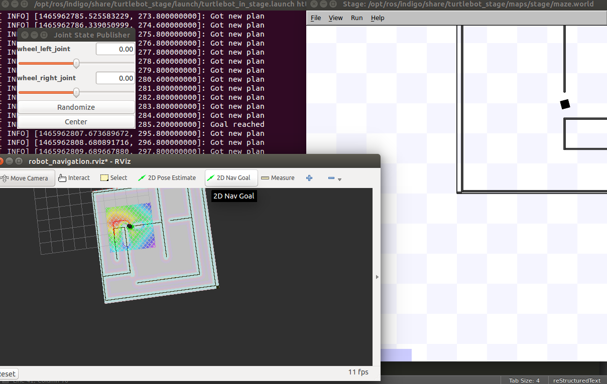
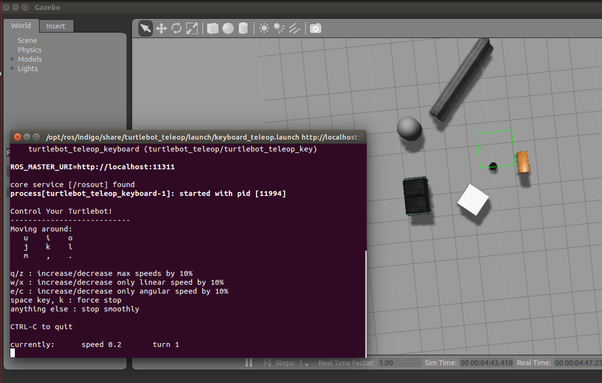
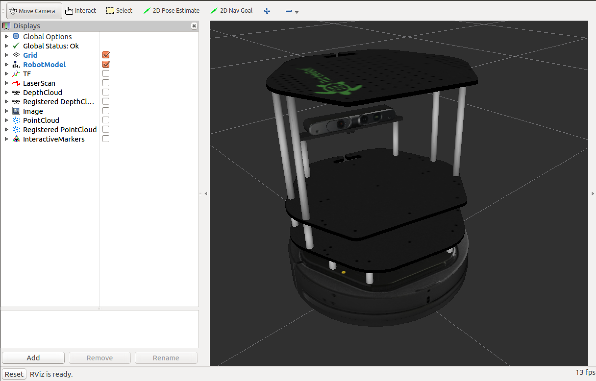

====================
Turtlebot Simulators
====================

In this page, we will learn about two different simulators to test your Turtlebot robot programs.

You need to install the software:

.. code-block:: bash

    sudo apt-get install ros-indigo-turtlebot-simulator

There is a couple of simulators that you can help you with your robot such as Gazebo, Stage, RViz and Stdr. The most used simulators are the Gazebo and the stage.

Stage Simulator
===============

In this section you will learn about:
	* Stage Simulator and how to launch it.
	* Customizing your simulator.

Stage is a 2D multi-robot simulator. It shows the user a world defined in a file with an extention `.world`. This world has everything the software needs to know from the obstacles, free space to robots and other objects.

Run the following command to run the Stage simulator:

.. code-block:: bash

    roslaunch turtlebot_stage turtlebot_in_stage.launch

.. image:: images/stage_rviz.png
    :align: center

Click on the `2D Nav Goal` option on the top bar and command the robot to go anywhere you want in the map.

The following picture is after you choose a position for the robot to go.

Open the turtlebot_stage directory and type 

.. code-block:: bash

    tree 

to be able to see all the files but we are intersted in the following files:

.. code-block:: python
    
    launch/turtlebot_in_stage.launch
    maps/maze.png
    maps/maze.yaml
    maps/stage/maze.world
    maps/stage/turtlebot.inc
    rviz/robot_navigation.rviz

The `.rviz` file has all the settings for the RViz simulator so you don't need to worry about. The ``turtlebot.inc`` file defines the layout and the sensor for the turtlebot robot.

.. NOTE:: 
	Make sure to keep a copy of the original files in case you did something wrong specially the ``.png`` ``.yaml`` ``.world`` files.

In order to edit the map you want to have, open the file ``maze.png`` with any editor and modify it.

Now you can run the simulator:

.. code-block:: bash

    roslaunch turtlebot_stage turtlebot_in_stage.launch

You can also choose the ``.world`` and ``.yaml`` files by using the following command:

.. code-block:: bash

    roslaunch turtlebot_stage turtlebot_in_stage.launch map_file:="~/path/to/new/file.yaml" world_file:="~/path/to/new/file.world"

Or in case you want to use the same files everytime you can run the following commands:

.. code-block:: bash

    export TURTLEBOT_STAGE_MAP_FILE=~/path/to/new/file.yaml
    export TURTLEBOT_STAGE_WORLD_FILE=~/path/to/new/file.world

or simply add them to your shell setup file:

.. code-block:: bash

    echo export TURTLEBOT_STAGE_MAP_FILE=~/path/to/new/file.yaml >> devel/setup.sh
    echo export TURTLEBOT_STAGE_WORLD_FILE=~/path/to/new/file.world >> devel/setup.sh

After you modify the map you may find out that the position of your robot is very close to an obstacle for example. Instead of moving the robot from the obstacle you can simply change the default position of the robot in the ``.world`` file by changing the values of the `pose [x y z theta]` 

.. NOTE::
	`theta` is in degree.

or you can change tho position when you launch the simulator:

.. code-block:: bash

    roslaunch turtlebot_stage turtlebot_in_stage.launch initial_pose_y:=2.0 initial_pose_x:=1.0

You can also add an obstacle in any position in the map and with any size you like by creating a new ``.inc`` file:

.. code-block:: python
	
	define block model
	(
	 size [0.5 0.5 1.0]
	 gui_nose 0
	)
The `size` parameters are in meters and the `gui_nose` parameter is to show the direction which the obstacle is facing. Make sure to include the ``.inc`` you just created for the block in the ``.world`` file on the top and then you can specify other details for the block:

In the ``.world`` file:

.. code-block:: python

	include "blockFile.inc"

	#add blocks and customize them
	block( pose [ 2.0 1.0 1.0 45.0 ] color "red")
	block( pose [ 1.0 2.0 2.0 0.0 ] color "black")

.. NOTE::
	You can add default customization for the block inside the ``.inc`` file. You can refer to this `page <http:playerstage.sourceforge.net/doc/stage-cvs/group__model.html>`_ for more customization. Make sure if you changed anything in the ``.yaml`` file to adjust the ``.world`` file.

Gazebo Simulator
================

In this section we will bring up the turtlebot robot in the `Gazebo` simulator.

To run the `Gazebo` simulator run the following command:

.. code-block:: bash

    roslaunch turtlebot_gazebo turtlebot_world.launch

.. image:: images/gazebo.png
    :align: center

.. NOTE:: 
	Gazebo may need a couple of updates before running to update its database and it will take a few moments.

Using Teleop package with Gazebo and RViz
=========================================

.. HINT::
	Try to make the teleop tutorial before you complete this tutorial to make sure you have all the necessary packages.

First, you need to bring up the `Gazebo` simulator as mentioned before. Second, open a new terminal and type the following:

.. code-block:: bash

    roslaunch turtlebot_teleop keyboard_teleop.launch

Try to move the robot around.

Now to be able to see what the robot is acually sees you can open a new terminal and launch the RViz simulator:

.. code-block:: bash

    roslaunch turtlebot_rviz_launchers view_robot.launch

.. NOTE::
	The RViz simulator may take a couple of minutes to be launched. Make sure you have a powerful PC with a good graphics card.